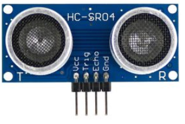

# :trophy: A.1.3 Learning activity 
## Objective

Conduct research and presentation to be exposed in class on the subject of sensors.
---
## :pencil2: Development

1. Use the following list of commercial sensor models to develop your activity:
- [ ] 1.1 Sensor Encoder infrared [FC-03](https://articulo.mercadolibre.com.mx/MLM-667245832-sensor-velocity-encoder-infrared-eyed-lm393-encoder-1-pz-_JM?quantity=1#position=1&type=item&tracking_id=d291ac0d-e965-42ec-8f24-9c21dba0524e)

- [ ] 1.2 Presence sensor for transmitter/receiver [QRD1114](https://w.mercadolibre.com.mx/MLM-761860464-2-pzas-qrd1114-sensor-infrared-reflective-tracker-_JM?quantity=1#position=3&type=item&tracking_id=a56bb0cb-d5dc-4f43-84cd-9e46feaa1cc6)

- [x] 1.3 Ultrasonic presence sensor [HC-SR04](https://articulo.mercadolibre.com.mx/MLM-780669402-sensor-ultrasonic-hc-sr04-sensor-distancing-_JM?quantity=1#position=1&type=item&_idtracking=aa4551b9-6b85-4a0d-b119-00b31360c7a4)

- [ ] 1.4 Sensor Temperature and humidity [DHT11](https://articulo.mercadolibre.com.mx/MLM-664315278-sensor-de-temperatura-y-humedad-dht11-cjumpers-arduino-pic-_JM?quantity=1#position=1&type=item&tracking_id=e28e7442-6ce8-420b-99e1-99b2efd2d51f)

- [ ] 1.5 Sensor Temperature and humidity [DHT12](https://articulo.mercadolibre.com.mx/ML-761350149-sensor-de-temperatura-y-humedad-dht22-arduino-_JM?quantity=1#position=1&type=item&tracking_id=509ff3d0-c091-4fbc-8ff5-63ff0c0adaec)

- [ ] 1.6 RGB colour sensor TCS34725

- [ ] 1.7 Sensor Control Remote Infrared [AX-1838HS](https://w.mercadolibre.com.mx/MLM-665821120-module-sensor-recognition-color-rgb-tcs34725arduino-_JM?quantity=1#position=1&type=item&tracking_id=fd55dc31-3426-49ad-999f-ef5cf0a70bf0)

- [ ] 1.8 Track tracking sensor [TCRT5000](https://articulo.mercadolibre.com.mx/MLM-602097604-modulo-tcrt5000-sensor-optico-reflective-arduino-pic-_JM?quantity=1#position=1&type=item&_idtracking=6e9e4318-5969-4b28-a765-17a08bd5dc3f)

- [ ] 1.9 Motion sensor [PIR HC-SR501](https://w.mercadolibre.com.mx/MLM-603369291-sensor-motion-motion-pir-hc-sr501-arduino-pic-_JM?quantity=1#position=1&type=item&tracking_id=59121a6f-e868-4aa0-ae14-430f1cfd2158)

- [ ] 1.10 Optical distance sensor [Sharp 2Y0A02/GP2Y0A02YK0F](https:///articulo.mercadolibre.com.mx/MLM-554899938-sensor-infrared-eyed-sharp-gp2y0a02yk-2y0a02-20-150cm-_JM?quantity=1#position=1&type=item&_tracking=155e5495-de69-4b76-a797-826cda4686c2)

2. Wait for the advisor to tell you what type of sensor will be develop your equipment and once you have marked the sensor within the previous point.
3. Once you know the topic to develop, research and write within this document the following points:

- **Home**, student information, advisor, career, subject, date,.

# NATIONAL TECHNOLOGY OF MEXICO
## TIJUANA INSTITUTE OF TECHNOLOGY
## ACADEMIC SUBDIRECTORATE
### SYSTEM DEPARTAMENT AND COMPUTING
#### **PERIOD:** February-June 2021
 
---
-----**Career**-----

Computerstystems engineer
 
-----**Matter**-----

Programmable systems
SCC-1023SC7B

**Classroom:** 9302               	**Schedule:** 18:00 – 19:00
 
-----**Theme**-----

A1.3 Commercial Sensor Types.

-----**Student name and control number**-----

Garcia Gonzalez Erick Ivan 		17212130

Gerardo Ramirez Jose 		17212137

Navarro Lopez Mauricio Antonio 	18210507

Regalado Lopez Edgar Eduardo	  18210507

-----**Teacher's name**-----

Jaime Leonardo Enriquez Alvarez

 -----**Deadline**-----

12/April/2021

- **Introduction**, a brief description of the topic.

During this research, the basic concepts of presence detection sensors will be revealed, more specifically the ultrasonic ones, how they work and their main characteristics, and in turn the research focuses on the HC-SR04 ultrasonic sensor, as we will see more. forward is a sensor that allows us to measure distances at which an object is found using ultrasound.

- **Development**

- **Definition**

Ultrasonic sensors measure distance through the use of ultrasonic waves. The head emits an ultrasonic wave and receives the reflected wave that returns from the object. Ultrasonic sensors measure the distance to the object by counting the time between emission and reception.

Es un sensor de ultrasonido usado frecuentemente en la detección de obstáculos, pero que con unos cuantos códigos se puede lograr medir la distancia entre el sensor y dicho obstáculo.

Este sensor tiene un precio módico, y en relación con su buena calidad es una inversión conveniente

- **Images** of the sensor

- Characteristics **physical**

1. Vcc: Power supply pin. (5V)
2. Trigger: Trigger pin. This pin is an input, so in the control system, for example Arduino, it has to be connected to an output.
3. Echo: This pin is a sensor output, so it must be connected to a control system input.
4. Gnd: Negative power pin.

- Characteristics **electric**

1. Voltage: 5 v
2. Amperage: 15 mA
3. Work frequency: 40 KHz
4. Work range: 0.02 to 5 m
5. Detection angle: 15 to 20 degrees

- Explain how it behaves with **environment** or what stimuli you respond to.

it is only necessary to apply a pulse
of 10uS on the trigger pin to start the measurement.

the sensor sends a series of 8 pulses of 40KHz and puts the Echo pin
at a high level.
The echo pin will remain high until echo pulses are received.
40 KHz.

To know the distance at which the object is, you just have to measure the
time the Echo pin is at high level and apply the following formula.

Cm = uS * 0.01715

- Application uses
- You can rely on a video that should not last more than 1/3 of the time of your presentation..
- **Conclusions** by each team member.

**Mauricio A. Navarro Lopez**
The ultrasonic sensor allows you to make an evaluation to know the distance between the sensor and an object, this has several applications in the industry, when working with ultrasonic frequencies it is capable of being used in humid places.

- **Bibliográfia**, add within this section any bibliography in which the development of the activity is supported, using labels and links.

Unknown, U. (2020). What is an ultrasonic sensor? | Sensor Basics: Guide to Sensors for Factories Classified by Principle | KEYENCE. Keyence.com.mx. Retrieved April 3, 2021 from https://www.keyence.com.mx/ss/products/sensor/sensorbasics/ultrasonic/info/.

Unknown, U. (2021). HC-SR04 Ultrasonic Sensor - Smelpro. Smelpro.com. Retrieved April 3, 2021, from https://smelpro.com/blog/sensor-hc-sr04/.

4. Insert images of **evidences** such as meetings of team members held for the development of the activity

1. Include the individual conclusions and results observed during the activity.

**Erick Iván García González**
Con esta investigación aprendí más sobre la existencia del sensor y su funcionamiento, pensando en dónde podría usarse en proyectos personales o dónde se ha podido usar en la industria o en productos comerciales.

**Mauricio A. Navarro Lopez**
With this research, the knowledge about different electronic components that exist, their operations and main characteristics that allows us to understand these and how to use them, specifically this research was carried out in the search for the ultrasonic sensor.

**Jose Gerardo Ramirez** 
Nunca antes había escuchado de este sensor, pues no estoy muy relacionado con estos temas, creo que es un sensor bastante útil y bastante usado por lo que lei puesto que este sensor mide la distancia a la que se encuentra un objeto frente a él y este sensor puede ser de mucha utilidad para muchas cosas diferentes.

---
### :bomb: Rubrica

| Criteria | Description | Score |
| ------------- | --------| ------- |
| Instructions | Each of the points indicated is met within the Instructions section? | 10 |
| Development | Each one was answered of the points requested within the development of the activity? | 60 |
| Demonstration | The student presents the explanation of the himself during functionality of the activity? | 20 |
| Conclusions | A personal opinion is included of the activity by each of the team members? | 10 |

:house: [Go to sensors](../docs/D1.0_Sensores.md)

[My GitHub](https://github.com/Josejgr27/Sistemas_Programables)
