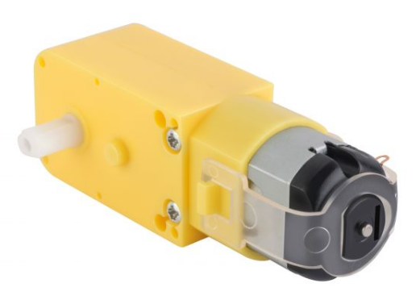
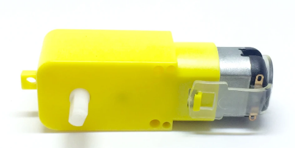
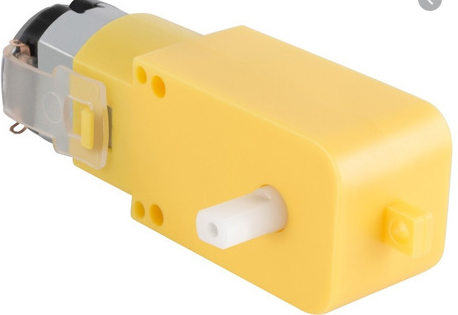
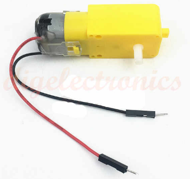
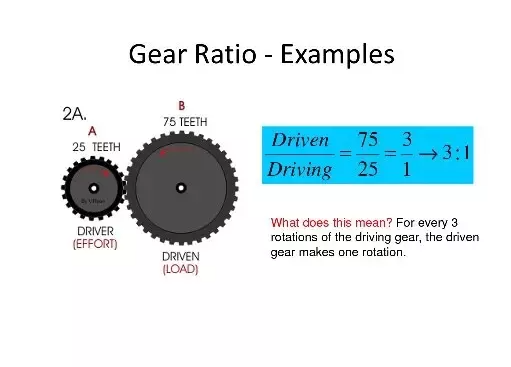

# Actuators
---
## :trophy: A.2.1 Learning activity

(Types of commercial electric actuators)

### :pencil2: Desarrollo 
---
1. Use the following list of commercial electric actuator models to develop your activity in accordance with the instructions requested by the advisor

- [X] Double Shaft Geared Motor

- [ ] Unipolar Stepper Motor

- [ ] Bipolar Stepper Motor Model

- [ ] SG90 Servomotor

2. Wait for the advisor to tell you what type of actuator will be developed by your team and once you get it, mark the actuator within the previous point.

3. Once you know the topic to be developed, research and write the following points in this document:

- Cover page, student information, advisor, career, subject, date, ..

.png)

# MEXICO INSTITUTE OF TECHNOLOGY
## TIJUANA INSTITUTE OF TECHNOLOGY
## ACADEMIC SUBDIRECTORATE
### SYSTEMS AND COMPUTING DEPARTAMENT 
#### **PERIOD:** February-June 2021
 
---
### Career ###

Computer stystems engineering
 
### Subject ###

Programmable systems
SCC-1023SC7B

### Classroom:9302 ###              	
### Schedule: 18:00 – 19:00 ###
 
### Topic ###

A2.1 Commercial Actuator Types.

### Students' names and control numbers ###

- Garcia Gonzalez Erick Ivan 		17212130

- Gerardo Ramirez Jose 		17212137

- Navarro Lopez Mauricio Antonio 	18210507

- Regalado Lopez Edgar Eduardo	  18212254

### Teacher's name ###

Jaime Leonardo Enriquez Alvarez

### Deadline ###

May/04/2021

- # Introduction, a brief description of what the topic is about.

This research is about the dual-axis geared motor, all its characteristics, the way it works to produce rotatory motion, and the main application this actuator could have in all sorts of project, this to give some insight on how to implement it in any project our classmates or us could have.

- # Development.

- ### Definition.

It is known as a geared motor to a very compact machine that combines a gearbox and a motor. These two components are joined, the gearbox is used to slow down and increment the strength of the dc motor.
It is a dc reducer motor, designed to be used in integrated applications requiring movement 

- ### Images of the actuator.

- ### Physical characteristics.
Axis number: 2   

Minimum operating temperature: -10 °C   

Maximum operating temperature: 65 °C  

Dimensions: 42 mm X 22.7 mm X 47.8 mm  

Form: Flat shape  

Material: Plastic  

Color: Yellow  

They come with dual axis on the sides with input for tires of 65x26mm.  

- ### Electrical characteristics.

OPERATING VOLTAGE: 3V – 6V.

no-load current (3 V): 1.5 A

no-load current (6 V): 3 A

no-load speed (3 V): 65 RPM + / - 10 %

angular velocity: 200 RPM.

reduction: 48:1

maximum current consumption: 150mA

- ### Explain the operation principle.

A geared motor is made of two componentes: a motor and a gearbox. The motor takes current and through electromagnetism (magnets, and copper coils that generate electromagnetic fields when a current passes through them) produces a circular motion which speed depends on the current applied.

The motion of the dc motor is fast, but it lacks torque (strength in its rotation), and that why a gearbox is needed.

The gearbox transforms the high speed of the dc motor to a lower speed with higher torque strength. The gearbox has a set of gears inside of it, where every gear moves at a lower speed than the one before it but with greater torque. The exact torque strength of the geared motor depends on the current applied to it and the amount of gears and teeth of the gears inside the gearbox.

Gear motors give a transmission ratio, this ratio (X:Y) means how many rotations of the first gear (X, in this cas de DC motor) produce Y rotations at the last gear (the output motion gear), the greater the ratio the slower and stronger the geared motor will be.

- ### Applicative uses.

A geared motor could be used for many projects needing strong mechanical motion, it doesn't matter if the motion needed is not rotatory, because rotatory motion can be transformed into linear motion using pistons.

examples of applicative uses could be:
- small vehicles, used in their wheels.
- any robotics project using hinges where strength is needed.
- any project using hinges such as opening doors.
- rotatory displays.
- any project using wheels in general.
- projects that need to lift small weights.

-- You can rely on a video that should not last more than 1/3 of the time of the presentation.

- # Bibliography, Add within this section all the bibliography in which you supported the development of the activity, using tags and links.

-Desconocido, D. (2019). MOTORREDUCTOR RECTO - Master Electronicos. Shop.master.com.mx. Retrieved 3 May 2021, from https://shop.master.com.mx/product/detail?id=7677.

-Desconocido, d. (2018). Motorreductores: Cómo funcionan y de qué elementos están compuestos - Roydisa. Roydisa. Retrieved 3 May 2021, from https://www.roydisa.es/archivos/5419.

- # 4. Insert images of evidences such as meetings of the team members held to the development of the activity

- # 5. Include the individual conclusions and results observed during the development of the activity.

### Edgar Regalado
I didn't know that normal dc motors lack the strength needed to do heavy tasks, its surprising to see how hard it is to stop a geared motor once it's running. The most interesting part was the use of laws of physical mechanics such as gears, and how their diameter and number of teeth affect the strength output of the geared motor. Now i also know that these kind of motors are very useful even when a linear motion is needed.

### Jose Gerardo

The gearmotors are widely used today, they can range from a small gearmotor capable of changing and combining rotational speeds on a clock, changing speeds in a car, to huge gearmotors capable of giving traction to large machines.

But in this case I learned that this helps us to change speeds depending on the reduction at which that gearmotor contains

### Mauricio Navarro

Specifically the dual-axis reducer motor has several applications and more in projects that require movement, despite being compact the this engine has great power.
In general the work allows us to know more about this component which allows us to know how it works and want to implement it how to do it.

### Erick García

While doing this practic I got to know that dual axis and single axis are very reliable component to work with, in a variety of sites they have good reviews, in addition that it is easy to use, they can be used in small car projects, also for moving some solar panel in any degree.

---
### :bomb: Rubric 

| Criteria | Description | Score |
| --------- | ----------- | ------- |
| Instructions | Is each of the points indicated in the Instructions section fulfilled? | 10 |
| Developing | Was each one of the points requested within the development of the activity answered? | 60 |
| Demonstration | Does the student introduce himself during the explanation of the functionality of the activity? | 20 |
| Conclusions  | Is a personal opinion of the activity included by each of the team members? | 10 |

[My Github](https://github.com/Mauricio-Navarro/Sistemas-Programables-Mauricio-Navarro)
