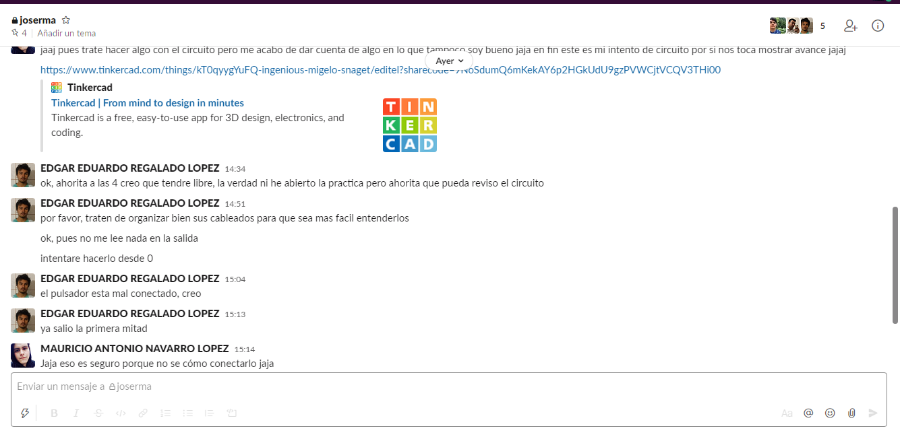
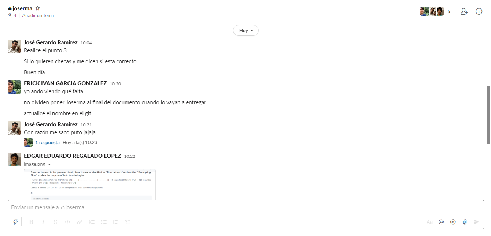
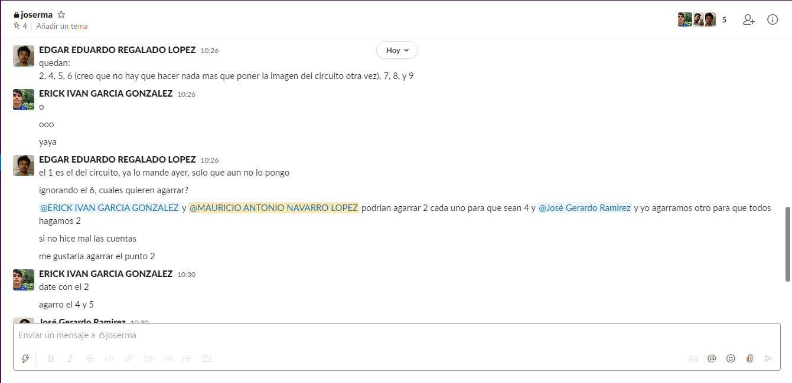

# Actuators
---
## :trophy: A.2.2 Learning activity

(Make a startup and turn on control system for an electric actuator using a 555 timer and a DC motor).

### :pencil2: Development
---
### 1. Use the following list of materials to develop the activity

| Quantity | Description |
| ------- | -------- |
| 1 | [Integrated circuit LM555](https://www.mecatronicalatam.com/es/tutoriales/electronica/componentes-electronicos/555/) |
| 1 | [Electrolytic capacitor of 47uf](https://mvelectronica.com/products/CE4725#:~:text=Un%20capacitor%20electrol%C3%ADtico%20es%20un,alta%20corriente%20y%20baja%20frecuencia.&text=Este%20es%20un%20capacitor%20que,voltaje%20m%C3%A1ximo%20de%2025%20V.)  |
| 1 | [Ceramic capacitor of 10nf](http://www.geekbotelectronics.com/producto/capacitor-ceramico-10-nf-50-v/#:~:text=Un%20capacitor%20cer%C3%A1mico%2010%20nF,separadas%20por%20un%20material%20diel%C3%A9ctrico.) |
| 1 | [Voltage source of 9V](https://es.wikipedia.org/wiki/Pila_9V#:~:text=La%20pila%209%20voltios%20o,pila%20el%C3%A9ctrica%20de%20nueve%20voltios.&text=La%20pila%209V%20se%20utiliza,y%20los%20mandos%20de%20aeromodelismo.) |
| 1 | [TIP122 Power Transistor](https://sandorobotics.com/producto/tip122/) |
| 1 | [1N4001 diode or equivalent](https://hetpro-store.com/diodo-rectificador-1n4001/) |
| 1 | [Mini DC Motor](https://mvelectronica.com/products/510-559) |
| 3 | [Resistors of 680,1k, 10k Ohm of 1 / 4w](https://www.significados.com/resistencia/) |
| 1 | [Trigger button](https://www.cofem.com/producto/pulsador-de-paro-y-disparo-pucpr-pucdr/) |
| 1 | [Red Led Diode](https://www.ugr.es/~juanki/LED.htm) |

### 2. Use the electronic circuit in the picture below and assemble stage 1 inside the simulator.

### 3. As can be seen in the previous circuit, there is an area identified as "Time network" and another "Decoupling filter", explain the purpose of both terminologies.
**Time network:** refers to the area where the timing of the 555 timer is controlled, here you will find the components that control the time.

**Decoupling filter:** because it is the area where the capacitor is located, investigating it says that it is the area where the signal is filtered, since the AC signals are decoupled from a DC signal.

### 4. Continuing with the previous image, observe the equation Ct = 1.1 * R1 * C1 that is shown, which is used to establish the time of output pulse on. Based on this equation above, calculate the values of R1 and C1 if you want to keep the output pulse on, given the 3 conditions required in the attached table.

   | Number | Condition  | Value of R1 | Value of C1 |
   | ------ | ---------- | ----------- | ----------- |
   | 1      | 3 segundos | 58kohm      | 47 µF       |
   | 2      | 5 segundos | 97kohm      | 47 µF       |
   | 3      | 8 segundos | 155komh     | 47 µF       |
    
    Using Ct= 1.1 * R1 * C1 and using resistors and a commercial capacitor it:

##### 3s
    Exact resistance
        R = 3s / (1.1 * 0.000047 F)
        R = 58,027 ohms

    Closest commercial resistors 
        56komh + 2kohm = 58kohm

    Calculated Time
        Ct= 1.1 * 58,000ohm * 0.000047F = 2.998s

##### 5s

    Exact resistance
        R = 5s / (1.1 * 0.000047 F)
        R = 96,711 ohms

    Closest commercial resistors
        82komh + 15kohm = 97kohm

    Calculated Time
        Ct= 1.1 * 97,000ohm * 0.000047F = 5.014s

##### 8s

    Exact resistance
        R = 8s / (1.1 * 0.000047 F)
        R = 154,738 ohm

    Closest commercial resistors
        150komh + 5kohm = 155kohm

    Calculated Time
        Ct= 1.1 * 155,000ohm * 0.000047F = 8.013s

### 5. Once the table above is completed, start the simulation for any of the three conditions and observe the behavior of the Led; explain your observation.  

As was expected when using the correct values in R1 and C1, the time for each one of the conditions is true as it must, it turns on at the moment of pressing  down the button and it turns off after completing the time setted.

### 6. Assemble stage 2 and integrate the terminal of the output pulse to the input of the base of the transistor of this second stage.

### 7. After completing the previous step, choose one of the 3 conditions recorded in the table above and observe the behavior of the DC motor; explain your observation.

The RC motor just like the LED, behaves in the same way, when pressing down the button the motor begins to spin until the time set ends and then it goes back to 0 rpm.

### 8. Once the stage 1 output pulse on time is complete, what happens with the DC motor? Explain the reason for this behavior?

Particularly with this circuit you can see how the timer works, as this affects the different components, which brings us to the next point. As the direct current motor is affected by the timer, simply while the timer allows the current passage the motor stays active, and after the set time has elapsed the motor is no longer active.

### 9. Insert images of evidences such as meetings of the team members held to the development of the activity

### 10. Include the individual conclusions and results observed during the development of the activity.

#### Navarro Mauricio

With the development of this activity that is clearer in the application of the 555 timer, specifically it can be seen with this practice how is that the LED and in the same way the engine are kept active for a certain period of dry time a certain time when one activates the circuit by pressing or the pushbutton, thus resulting in the better understanding of how exactly the timer works allowing the flow of current for a certain time.

#### Regalado Edgar

To be honest at first i didn't understand the real world function a timer that needs to be triggered everytime could serve. After this practice i realized that with enough resitance and capacitance one can make an actuator stay on for very long time without having to press the button again until the set time is elapsed. I think a lot of electronic toys use timers now, like the toys that turn lights on with a button press for some time. Also, this is the first time I've used capacitors in an actually useful way.

#### Gerard Ramirez Jose

In this practice, what we did was use an LM555 integrated circuit as if it were a timer for a motor, to be able to modify the time that energy was going to be allowed to pass, we used a resistor and capacitor with different values ​​to modify the number of seconds it was going To pass current, this time applied after pressing the button that worked as a triger, we used the same capacitor for all cases, what we varied was the resistance and we tried to continue using commercial resistance values.

---
### :bomb: Rubrica 

| Criteria | Description | Score |
| --------- | ----------- | ------- |
| Instructions | Is each of the points indicated in the Instructions section fulfilled? | 10 |
| Developing | Was each one of the points requested within the development of the activity answered? | 60 |
| Demonstration | Does the student introduce himself during the explanation of the functionality of the activity? | 20 |
| Conclusions | Is a personal opinion of the activity included by each of the team members? | 10 |

[My Github](https://github.com/Josejgr27/Sistemas_Programables)
