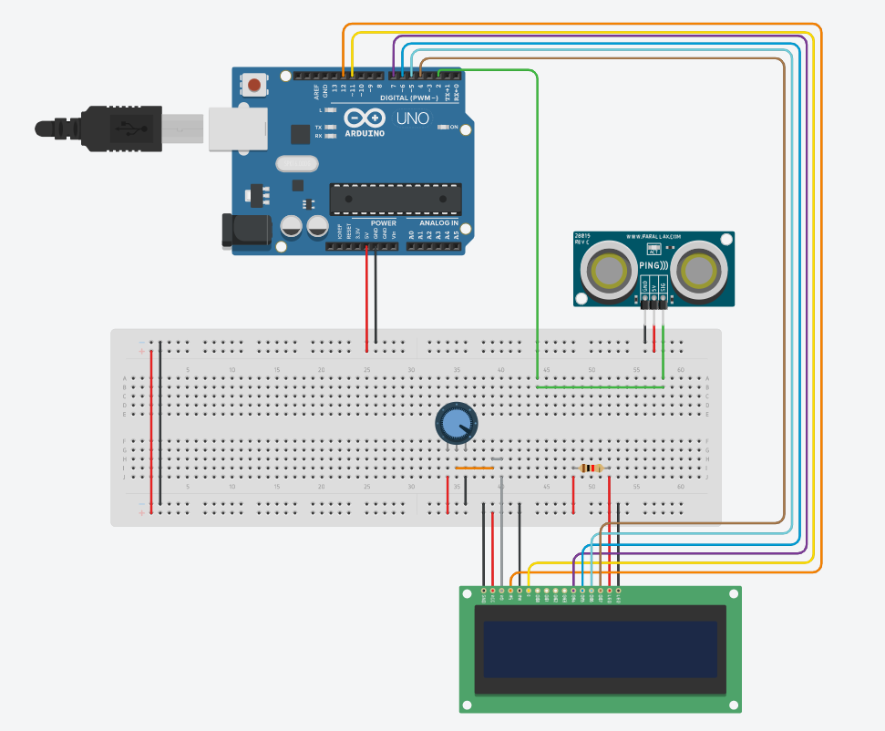
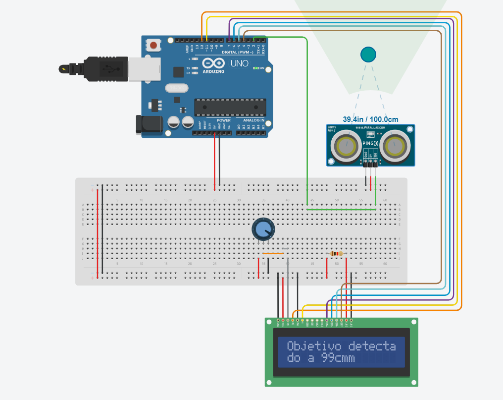
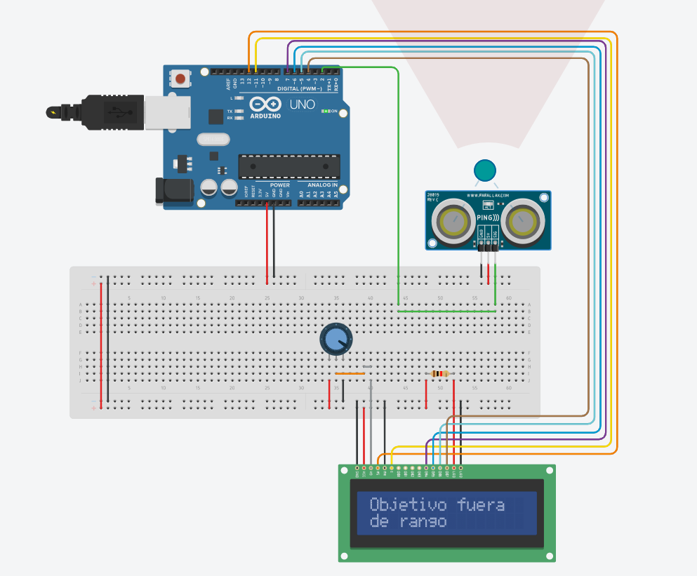
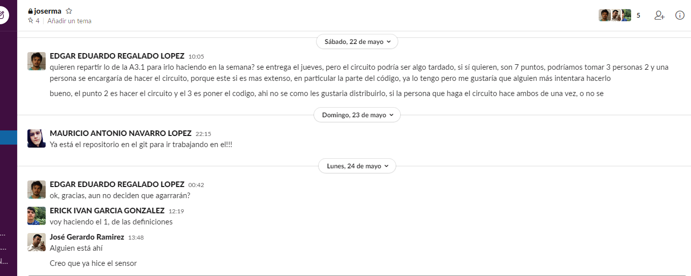
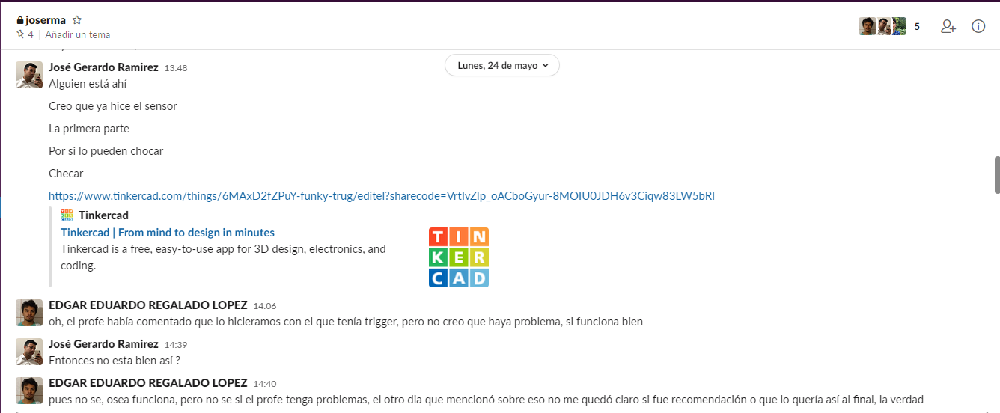
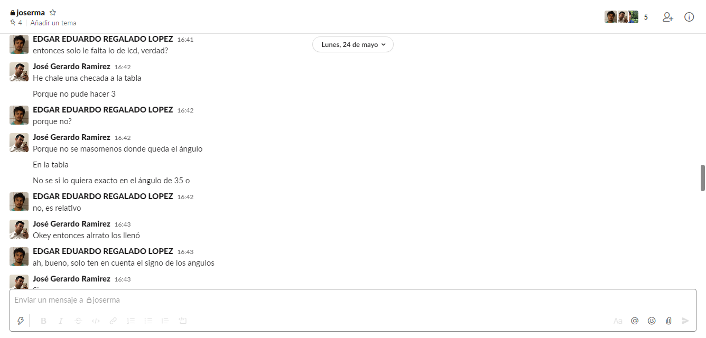

# :trophy: A.3.1 Learning activity

(Object detection sensor circuit, using an Arduino, an ultrasonic sensor and a 16x2 LCD I2C Display)

### :pencil2: Development 
---

#### 1.Use the following list of materials to prepare the activity

| Quantity | Description |
| ---- | ---- |
| 1 |  [Ultrasonic Sensor HC-SR04](amazon.com.mx/SainSmart-HC-SR04-Ranging-Detector-Distance/dp/B004U8TOE6/ref=sr_1_5?__mk_es_MX=ÅMÅŽÕÑ&dchild=1&keywords=hc-sr04&qid=1599005012&sr=8-5) |
| 1 |  [16x2 LCD display](https://hetpro-store.com/lcd-16x2-blog/) |
| 1 | [5V power supply](https://www.amazon.com.mx/redcolourful-Breadboard-Supply-Switched-Ar-duino/dp/B0831F4HKY) |
| 1 | [10K potentiometer](https://www.amazon.com.mx/Uxcell-a15011600ux0235-Linear-Rotary-Potentiometer/dp/B01DKCUVMQ/ref=sr_1_1?__mk_es_MX=%C3%85M%C3%85%C5%BD%C3%95%C3%91&dchild=1&keywords=potenciometro+10k&qid=1599005041&sr=8-1) |
| 1 | [Arduino UNO](https://www.amazon.com.mx/Progressive-Automations-LC-066-Arduino-Rev3/dp/B00WH5XOJK/ref=sr_1_7?__mk_es_MX=%C3%85M%C3%85%C5%BD%C3%95%C3%91&dchild=1&keywords=arduino+uno&qid=1599005073&sr=8-7) |

#### 2. . Based on the image shown, assemble inside the simulator to be used, the electronic circuit indicated in the Figure 1.


<br>

#### 3. Write the program that allows to receive the value registered by the **Ultrasonic Sensor** through one of the Arduino's inputs when approaching an object at different distances.

```c
  int cm = 0;

    long sensor(int triggerPin, int echoPin)
    {
      pinMode(triggerPin, OUTPUT); 
      digitalWrite(triggerPin, LOW); 
      delayMicroseconds(2); 
      digitalWrite(triggerPin, HIGH); 
      delayMicroseconds(10);
      digitalWrite(triggerPin, LOW);
      pinMode(echoPin, INPUT); 

      return pulseIn(echoPin, HIGH);
    }

    void setup()
    {
      Serial.begin(9600);
    }

    void loop()
    {
      cm = sensor(7, 7) / 58.2; 
      Serial.print(cm);
      Serial.println("cm");
      delay(100);
    }
```

#### 4. Considering that the ultrasonic sensor has a minimum and maximum detection range based on the return time of the sonic signal, what values are obtained in the simulation under the **following terms:**

| Number | Condition 1 | Condition 2 | Is the object detected? |
| ------ | ------ | ------ | ------ |
| 1 | 5 cm distance to sensor | 0 degrees to the perpendicular axis of the senso |  yes |
| 2 | 50 cm distance to sensor | 35 degrees to the perpendicular axis of the sensor | yes |
| 3 | 100 cm distance to sensor | -35 degrees to the perpendicular axis of the sensor | yes |
| 4 | 5 cm distance to sensor | 90 degrees to the perpendicular axis of the sensor | no  |
| 5 | 50 cm distance to sensor | -60 degrees to the perpendicular axis of the sensor | no |
| 6 | 350 cm distance to sensor | 0 degrees to the perpendicular axis of the sensor | no |

#### 5. Once the previous points have been completed, add to Figure 1, an I2C 16x2 LCD Display, and place the image of the complete circuit to this section.



#### 6. Once you have completed the integration of the I2C Display, modify the program so it allows you to show the following message through the display, "Target detected at? cm" ,and in case of not achieving detection, indicate the message "Target out of range ".

```c
 #include <LiquidCrystal.h>

    //lcd
    int rs = 12, en =11, d4 = 7, d5 = 6, d6 = 5, d7 = 4;
    LiquidCrystal lcd(rs, en, d4, d5, d6, d7);

    int cm = 0;
    
    long sensor(int triggerPin, int echoPin)
    {
      pinMode(triggerPin, OUTPUT); 
      digitalWrite(triggerPin, LOW); 
      delayMicroseconds(2); 
      digitalWrite(triggerPin, HIGH); 
      delayMicroseconds(10);
      digitalWrite(triggerPin, LOW);
      pinMode(echoPin, INPUT); 

      return pulseIn(echoPin, HIGH);
    }

	void lcd_imprimir_dis(int distancia) {
      if(distancia < 330) { //330 aprox la distancia max
        lcd.setCursor(0, 0);
        lcd.print("Objetivo detecta");
        lcd.setCursor(0, 1);
        lcd.print("do a ");
        lcd.print(distancia);
        lcd.print("cm");
      } else {
        lcd.clear();
        lcd.setCursor(0, 0);
        lcd.print("Objetivo fuera");
        lcd.setCursor(0, 1);
        lcd.print("de rango");
      }
	}

    void setup()
    {
      Serial.begin(9600);
      lcd.begin(16, 2);
    }

    void loop()
    {
      cm = sensor(2, 2) / 58.2; 
      //Serial.println("cm");
      lcd_imprimir_dis(cm);
      delay(500);
    }


```

#### 7. Place here evidence that you consider important during the development of the activity.




#### 8. Insert images of evidences such as meetings of the team members held to the development of the activity.





#### 9. Include the individual conclusions and results observed during the development of the activity.

**Edgar Regalado**

I found using the distance sensor fairly easy to use, you just have to send a PWM and translate the PWM that you receive as a result, containing the time it took the sensor to get the sound to bounce back at it. I think the hardest part of this practice was using the LCD because it requires you to connect a lot of pins in order to get it to work, and its not very intuitive cause you have to change the column manually, put its easy than setting each pixel individually, which is something i had to do for a virtual 7 segment display in another class.

**Navarro Mauricio**

The main objective of this activity is to understand the operation of the ultrasonic sensor, as is that it particularly does not measure distances but the time when the wave of the emitted frequency take to return, in the same way evaluated the different ranges with which it is handled, a plus in the objective of this activity was to add the display to be able to appreciate the different ranges with which this sensor works.

**Jose Gerardo**

The integrated circuit of this practice consists of two phases, where the first phase only involves measuring with an ultrasonic sensor certain circumstances requested in the practice and we had a bit of problems in which reference point to use for the measurements of the degrees. In the second phase the complications began when wanting to apply an LCD screen, we helped ourselves with quite a few guides due to the complexity that the handling of so many pins presented.

**Erick Garcia**

We used a three-pin ultrasound sensor, the one that tinkercad provided and well what we saw is that first before anything else out of range the object shows the highest value it can, I imagine because it assumes that the object is at a very far distance, and then using the value that returns and multiplying by 0.01723 is how we convert to cm, this value is printed on the monitor.

---
### :bomb: Rubrica 

| Criteria | Description | Score |
| --------- | ----------- | ------- |
| Instructions | Is each of the points indicated in the Instructions section fulfilled? | 10 |
| Developing  | Was each one of the points requested within the development of the activity answered? | 60 |
| Demonstration | Does the student introduce himself during the explanation of the functionality of the activity? | 20 |
| Conclusions  | Is a personal opinion of the activity included by each of the team members? | 10 |

[My Github](https://github.com/Josejgr27/Sistemas_Programables)
