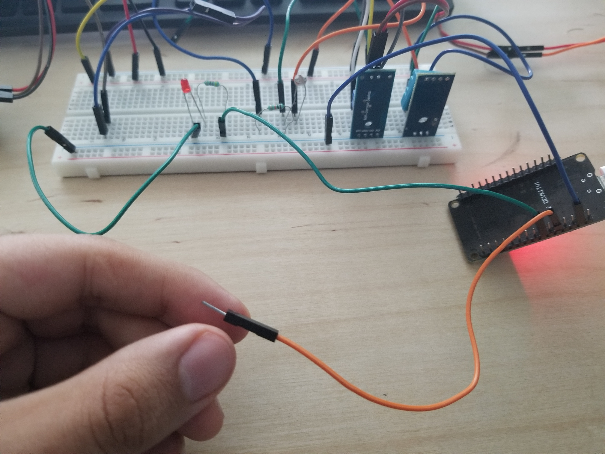

# :trophy: A.3.2 Learning activity
---

(Touch sensor circuit through a NodeMCU ESP32)

### :pencil2: Desarrollo 
---

#### 1.Use the following list of materials to prepare the activity

| Quantity | Description |
| ------ | ------- |
| 1 | [Red led diode](https://mexico.newark.com/lighting-led-technology#:~:text=Un%20diodo%20emisor%20de%20luz,una%20sola%20longitud%20de%20onda.) |
| 1 | [330 ohms resistance](https://blog.330ohms.com/2020/09/23/electronica-basica-resistores/) |
| 1 | [5V power supply](https://www.electronics-tutorials.ws/dccircuits/voltage-source.html) |
| 1 | [NodeMCU ESP32](https://www.amazon.com.mx/ESP-32-ESP-32S-ESP-WROOM-32-ESP32-S-desarrollo/dp/B07TBFC75Z/ref=sr_1_2?__mk_es_MX=%C3%85M%C3%85%C5%BD%C3%95%C3%91&dchild=1&keywords=esp32&qid=1599003438&sr=8-2) |
| 1 | [BreadBoard](https://www.amazon.com.mx/Deke-Home-Breadboard-distribuci%C3%B3n-electr%C3%B3nica/dp/B086C9HK7V/ref=sr_1_22?__mk_es_MX=%C3%85M%C3%85%C5%BD%C3%95%C3%91&dchild=1&keywords=breadboard&qid=1599003455&sr=8-22) |
| 1 | [Jumpers M / M](https://www.amazon.com.mx/ELEGOO-Macho-Hembra-Macho-Macho-Hembra-Hembra-Protoboard/dp/B06ZXSQ5WG/ref=sr_1_1?__mk_es_MX=%C3%85M%C3%85%C5%BD%C3%95%C3%91&dchild=1&keywords=jumper+wires&qid=1599003519&sr=8-1) |
| 1 | [Aluminum sheet](https://www.aluminum.org/industries/processing/sheet-plate#:~:text=Aluminum%20from%200.008%20inches%20to,inches%20and%20thicker%20is%20plate.&text=Aluminum%20plate%20is%20used%20for,gain%20strength%20at%20supercold%20temperatures.) |


#### 2. Once the previous circuit has been assembled, write a program that allows the circuit to meet the following conditions:
**[Link to the code](https://github.com/Mauricio-Navarro/Joserma/blob/main/A3.2%20ESP32%20SensorTouch/touch_esp32.ino)**

```c
// Primero establecemos los pines que vamos a utilizar
 //gpio
int gpio_touch = 4;
int gpio_led = 17;

//lectura y estado
int reading;
int state;
int threshold = 20;

bool flag_touched = false;

//Establecemos las propiedades de señal pwm
int frequency = 5000;
int channel = 0;
int resolution = 8;

void setup() {
  // put your setup code here, to run once:
  Serial.begin(115200);
  state = 0;
  //pwm: setup
  ledcSetup(channel, frequency, resolution); // configurar funcionalidades LED PWM
  pinMode(gpio_led, OUTPUT); //  sirve para configurar el modo de trabajo de un pin pudiendo ser INPUT (entrada) u OUTPUT (salida).
}
```

- The system should be able to turn on and off a LED by pressing the touch sensor.
```c
  reading = touchRead(gpio_touch); // leemos el valor del sensor touch y lo asignamos a la variable reading
  Serial.println(reading); // imprime el dato de reading
  flag_touched = reading < threshold;

  if(state == 0) {
    if(flag_touched) {
      state = 1;
      ledcAttachPin(gpio_led, channel);
      for(int duty = 0; duty <= 255; duty++) {
        Serial.println(duty);
        ledcWrite(channel, duty);
        delay(15);
      }
    }
  } else {
    if(flag_touched) {
      state = 0;
      ledcDetachPin(gpio_led);
      for(int i = 0; i < 3; i++) { //blinking
        digitalWrite(gpio_led, LOW);
        delay(1000);
        digitalWrite(gpio_led, HIGH);
        delay(1000);
      }
      digitalWrite(gpio_led, LOW); //turn off
    }
  }
```        
- The system must have the feature that if the LED is ON, when the touch sensor is touched, it will initiate an intermittent sequence of 3 seconds (that is, it turns off for 1 second, turns on for one second and finally turns off).
```c
if(flag_touched) {
      state = 0;
      ledcDetachPin(gpio_led);
      for(int i = 0; i < 3; i++) { //blinking
        digitalWrite(gpio_led, LOW);
        delay(1000);
        digitalWrite(gpio_led, HIGH);
        delay(1000);
      }
      digitalWrite(gpio_led, LOW); //turn off
    }
```   
- The system must have the feature that if the LED is OFF, when touching the touch sensor, it will light up little by little until it reaches its maximum illumination level.
```c
 if(state == 0) {
    if(flag_touched) {
      state = 1;
      ledcAttachPin(gpio_led, channel);
      for(int duty = 0; duty <= 255; duty++) {
        Serial.println(duty);
        ledcWrite(channel, duty);
        delay(15);
      }
    }
  }
```
#### 3.  Place here evidence that you consider important during the development of the activity.

**This is the circuit before touching the sensor pin.**

**NOTE: ONLY THE LED AND RESISTANCE CONNECTED ARE RELEVANT FOR THIS, THE REST IS FROM ANOTHER PROJECT AND WOULD BE TIME WASTING TO DISCONNECT EVERYTHING EVERYTIME I HAVE TO TEST THE CIRCUIT, MY APOLOGIES.**


**This is the LED after the first touching, the light is getting more intense, but in this picture doesnt show highest level of light yet.**


**This IS the highest level of light, once the LED reaches this points it will stay ON until another touch interaction in registered.**


**The moment the touch sensor is touched the LED starts blinking (it blinks 3 times, for 3 seconds) and then turns off, going back to the first state.**



#### 4. Insert images of evidences such as meetings of the team members held to the development of the activity.


#### 5. Include the individual conclusions and results observed during the development of the activity.

**Edgar Regalado**

This one was tricky, at first i couldn't figure out how the PWM worked, and once i read the tutorials given, i had a bug where once the pwm was set to the maximum at 255 i just couldn't turn the LED OFF to make the blinking effect. Turns out you need to detach the LED pin from the PWM channels so it will stop receiving its values, other way it would keep reading a HIGH (255) value. Using PWM to 'mimic' analog values using digital signals seems very useful in a lot of things. Also the touch sensor is kinda faulty, sometimes if would turn on with no touching at all.

**Erick Garcia**

As conclusion for this practice, I can say that the part that is interesting for me was  the pin touch because I had the impression that it was more like a sensor, to know it can be used with the elbow makes think how does it work the touch sensor of my phone, about the code, it looks very similar to what we have been doing but also about how make it turn on slowly and do the intermittence it was kinda tricky.

**Jose Gerardo**

Honestly, it was a practice in which I had to work very little on it, it was difficult for me since the circuit had to be physical, therefore I did not understand much about it, I had to investigate about it separately.

### :bomb: Rubrica 

| Criteria | Description| Score|
| --------- | ----------- | ------- |
| Instructions | Is each of the points indicated in the Instructions section fulfilled? | 10 |
| Developing | Was each one of the points requested within the development of the activity answered? | 60 |
| Demonstration | Does the student introduce himself during the explanation of the functionality of the activity? | 20 |
| Conclusions | Is a personal opinion of the activity included by each of the team members? | 10 |

[My Github](https://github.com/Mauricio-Navarro/Sistemas-Programables-Mauricio-Navarro)
