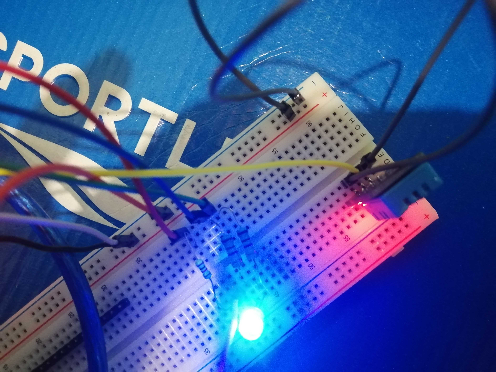

# :trophy: A3.3 Learning activity

(Temperature measurement circuit through an ESP32 NodeMCU)

### :pencil2: Development
---
#### 1. Use the following list of materials for the elaboration of the activity.

| Quantity | Description |
| -------- | ----------- |
| 1 | [Temperature and humidity sensor DHT11 or DHT22](https://www.mouser.com/datasheet/2/758/DHT11-Technical-Data-Sheet-Translated-Version-1143054.pdf) |
| 1 | [RGB led diode](https://www.arduino.cc/documents/datasheets/LEDRGB-L-154A4SURK.pdf) |
| 1 | [4.7 kohms resistor](https://www.adafruit.com/product/2783) |
| 3 | [1 kohm resistor](https://www.sparkfun.com/products/14492) |
| 1 | [5V power supply](https://uk.rs-online.com/web/p/desktop-power-supplies/1262122/) |
| 1 | [esp32 nodeMCU](https://naylampmechatronics.com/espressif-esp/384-nodemcu-32-esp32-wifi.html) |
| 1 | [BreadBoard](https://components101.com/asset/sites/default/files/component_datasheet/Breadboard%20Datasheet.pdf) |
| 1 | [M/M jumpers](https://www.tinytronics.nl/shop/en/cables/dupont-jumper-wire-male-male-20cm-10-wires) |

#### 2. Based on the images shown in Figures 1, assemble the circuit into a single electronic circuit, ide in such a way that a system capable of complying with the instructions requested above for this activity can be obtained.


#### 3. Once the above circuit is assembled, add an RGB LED and develop the program that allows the RGB LED to function as an indicator for the following conditions:

**[Link to the code](https://github.com/Mauricio-Navarro/Joserma/blob/main/A3.3%20ESP32%20SensorTemperatura%20DHT11/Sensor_de_temperatura_ESP32.ino)**

```C

//int gpio_voltaje = 27;
int gpio_entrada = 25;

const int ledR = 18;
const int ledB = 5;
const int ledG = 14;

// PWM
const int freq=5000;
const int resolucion = 8;
//channels
const int red = 3;
const int blue = 2;
const int green = 1;

#include "DHT.h"
#define DHTTYPE DHT11
DHT dht(gpio_entrada, DHTTYPE);
void setup() {
  // put your setup code here, to run once:
 // pinMode(gpio_voltaje, OUTPUT);
  pinMode(gpio_entrada, INPUT);
  //digitalWrite(gpio_voltaje, HIGH); //usar como voltaje
  Serial.begin(115200);
  dht.begin();

  //Configuration PWM
  ledcSetup(red,freq,resolucion);
  ledcSetup(blue,freq,resolucion);
  ledcSetup(green,freq,resolucion);

  // Senial-pin
  ledcAttachPin(ledR,red);
  ledcAttachPin(ledB,blue);
  ledcAttachPin(ledG,green);
  
  delay(200);
}
```
- The temperature sensor at all times will be feeling, sending the value recorded by the serial terminal, for example "Ambient temperature: 25 degrees" and the RGB LED will be on green.

``` C
  if (temp>=20 && temp<=30){
  Serial.print("Ambient temperature: ");
  Serial.print(temp);
   Serial.println(" degrees celsius");
  ledcWrite(red,256);
  ledcWrite(blue,256);
  ledcWrite(green,0);
  }
```

- The temperature sensor when registering a value of ~20% above the ambient temperature, should display the message "High temperature: ? degrees" and the RGB LED will turn red.

``` C
  else {
    Serial.print("High temperature: ");
    Serial.print(temp);
    Serial.println(" degrees celsius");
    ledcWrite(red,0);
    ledcWrite(blue,256);
    ledcWrite(green,256);
  }
  ```

- When the temperature sensor registers a value of ~20% below the ambient temperature, it should display the message "Low temperature: ? degrees" and the RGB LED will turn blue.

``` C
  else if (temp<20){
  Serial.print("Low temperature: ");
  Serial.print(temp);
  Serial.println(" degrees celsius");
  ledcWrite(red,256);
  ledcWrite(blue,0);
  ledcWrite(green,256);
  }

```

#### 4. Place here evidence that you consider important during the development of the activity.





#### 5. Insert images of evidences such as meetings of the team members held to the development of the activity.

%2014.33.23.png)
%2014.33.44.png)

#### 6. Include the individual conclusions and results observed during the development of the activity.

**Edgar Regalado**

Temperature and humidity are important variables for a lot of things: from comfort in places like homes or public buildings, to huge factories and proceses where the slightest change in temperature or humidity makes a different in the outcome of a product. The circuit we built here does not only read the temperature of its surroundings, but also has the ability to react to it, those reactions can change its environment: changing the color of a RGB LED, though just changing color might not seem so important, the truth is it helps a lot, cause it gives important information to the people in charge of monitoring temperature.

**Erick Garcia**

Like in every practice we have been working on, I think this in specific was the hardest to understand because i think the learning was much higher, since we trying to find out the problem  the sensor had, plus we made other modifications and try new stuff, like make sure that the RBG were common cathode and not anode, change values manually, to imagine how lower or increase the temperature, this practice  was such and interesting that leaves a lot of knowledge.

**Mauricio Navarro**

With the development of this activity we can realize that there are many ways to implement the ESP32 to in this case we use what is a DHT11 temperature sensor and an RGB LED with which it allows us to develop a circuit where the temperature is measured and with the help of LED lighting can be finished in a more visual way the temperature that the sensor is receiving , this type of circuits have different applications, and although here we can see it in a way that may not be so complex, this is implemented for procedures that are considered very important. The activity was successfully accomplished or and generating a large learning curve because there is a possibility of not having used most of these components before.

**Jose Gerardo**

As can be seen in the video and evidence, we had many problems when using the rgb led and the dht11 sensor, but after much searching we found some solutions, but not everything, in the same way the purpose of the activity that is to visually reflect the temperature through the console and clear the rgb led changing its color depending on the reading, as well as it was used for the led, it could also be used for stations and / or simple meteorological web pages, since the sensor has its limit, and as for the led, the color possibilities are open, as we can combine colors to create new ones.


---
### :bomb: Rubric 

| Criteria | Description| Score|
| --------- | ----------- | ------- |
| Instructions | Is each of the points indicated in the Instructions section fulfilled? | 10 |
| Developing | Was each one of the points requested within the development of the activity answered? | 60 |
| Demonstration | Does the student introduce himself during the explanation of the functionality of the activity? | 20 |
| Conclusions | Is a personal opinion of the activity included by each of the team members? | 10 |

**GitHub's Links**

[Edgar Regalado](https://github.com/RegaladoEdgar/Sistemas-Programables)

[Mauricio Navarro](https://github.com/Mauricio-Navarro/Sistemas-Programables-Mauricio-Navarro)

[Erick Garcia](https://github.com/ggerick/PrimeVault)

[Jose Gerardo](https://github.com/Josejgr27/Sistemas_Programables)
