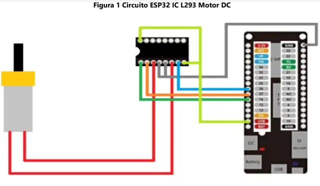

# :trophy: A4.1 Learning activity

(Control circuit to activate and deactivate a DC motor, using NodeMCU ESP32 via Bluetooth)
---


### :pencil2: Development 
---
#### 1.Use the following list of materials to prepare the activity

| Quantity | Description |
| -------- | ----------- |
| 1 | [IC L293D](https://hetpro-store.com/TUTORIALES/l293d/#:~:text=El%20circuito%20integrado%20L293D%20es,4%20mitades%20de%20puente%2DH.&text=Una%20de%20las%20principales%20ventajas,4.5%20Vdc%20hasta%2036%20Vdc.) |
| 1 | [5V power supply](https://docs.rs-online.com/275b/A700000006857541.pdf) |
| 1 | [NodeMCU ESP32](https://www.amazon.com.mx/ESP-32-ESP-32S-ESP-WROOM-32-ESP32-S-desarrollo/dp/B07TBFC75Z/ref=sr_1_2?__mk_es_MX=%C3%85M%C3%85%C5%BD%C3%95%C3%91&dchild=1&keywords=esp32&qid=1599003438&sr=8-2) |
| 1 | [BreadBoard](https://www.amazon.com.mx/Deke-Home-Breadboard-distribuci%C3%B3n-electr%C3%B3nica/dp/B086C9HK7V/ref=sr_1_22?__mk_es_MX=%C3%85M%C3%85%C5%BD%C3%95%C3%91&dchild=1&keywords=breadboard&qid=1599003455&sr=8-22) |
| 1 | [Jumpers M / M](https://www.amazon.com.mx/ELEGOO-Macho-Hembra-Macho-Macho-Hembra-Hembra-Protoboard/dp/B06ZXSQ5WG/ref=sr_1_1?__mk_es_MX=%C3%85M%C3%85%C5%BD%C3%95%C3%91&dchild=1&keywords=jumper+wires&qid=1599003519&sr=8-1) |

#### 2. Based on the images shown in the Figure 1, assemble an electronic circuit, in order to obtain a system capable of complying with the following instructions:

- By means of the "Serial Bluetooth terminal" application that can be downloaded from the google play Store or even any other that you consider, the starting and stopping of an motor must be controlled. DC, that is, there will be two requests, one of which represents the "START" and the other option "STOP"

- The motor must be able to rotate clockwise for 5 seconds, at the end of that time it must brake for 1 second and reverse its rotation for another 5 seconds.



#### 3. Place here the image of the assembled circuit.


#### 4. Place in this place the program created within the Arduino environment.

[Link to the code](https://github.com/Mauricio-Navarro/Joserma/blob/main/A4.1%20ESP32%20L293D%20Control%20MotorDC%20Bluetooth/esp32_blue_motor.ino)

```C
#include "BluetoothSerial.h"
BluetoothSerial SerialBT; //com bluetooth

TaskHandle_t BTooth; //multitask for bluetooth

int pin_neg = 32;
int pin_pos = 33;

void setup() {
  // put your setup code here, to run once:
  Serial.begin(115200);
  SerialBT.begin("ESP32");
  pinMode(pin_pos, OUTPUT);
  pinMode(pin_neg, OUTPUT);
  
  //creating a task for core 1
  xTaskCreatePinnedToCore(
    BToothCode,
    "Bluetooth task",
    10000,
    NULL,
    1,
    &BTooth,
    1);
    
  delay(100);
  Serial.println("ESP32 Device, Bluetooth ready.");
}

bool flag_continue = true; //start or stop
bool flag_state = true; //clockwise or counterclockwise
String message; //msg received from bluetooth

void BToothCode(void* params) {
  while(true) {
    if(SerialBT.available()) {
      message = SerialBT.readString(); //read bluetooth message
      if(message == "STOP") {
        Serial.println("stopping...");
        flag_continue = false;
        digitalWrite(pin_neg, LOW);
        digitalWrite(pin_pos, LOW);
      }
      if(message == "START") {
        Serial.println("starting...");
        flag_continue = true;
        flag_state = true; //start clockwise
      }
      delay(20);
    } 
  }
}

void loop() {
  // if not stopped...
    if(flag_continue) {
      use_motor();
    }
}

void use_motor() {
  if(flag_state) { //clockwise
      digitalWrite(pin_pos, HIGH);
      digitalWrite(pin_neg, LOW);
      Serial.println("Derecha");
   } else { //counter-clockwise
      digitalWrite(pin_neg, HIGH);
      digitalWrite(pin_pos, LOW);
      Serial.println("Izquierda");
    }
    delay(5000);
    //shift: 1 second before changing
    if(!flag_continue) { //if the flag change, dont wait the 1 sec
      return;
    }
    digitalWrite(pin_pos, LOW);
    digitalWrite(pin_neg, LOW);
    Serial.println("Cambio");
    delay(1000);
    flag_state = ! flag_state;
}
```

#### 5. Place here evidence that you consider important during the development of the activity.

![](./A414.jpeg


#### 6. Insert images of evidences such as meetings of the team members held to the development of the activity.


#### 7. Include the individual conclusions and results observed during the development of the activity.

### Jose Gerardo 

The following practice did not seem very complex to me since most of its logic has a lot to do with some of the programs already related in other matters except that in this one it has other connections and keywords, at the beginning the engine turned to one side and then it stopped, turned for the other and stopped, we had to put it to start again, that was fixed using flags since we were only changing the state of the motor pins.
It seemed to me a very useful practice because after here there may be different variants of projects that could be very useful in the future, it is a good introductory project for bluetooth


### Regalado Edgar

I thought working with bluetooth would be harder, but maybe it was easier because the comunication only sends data strings, and not complex data objects like music, which bluetooth is mostly used for. I think the most interesting part of this practice was using multitasking, i was reading the ESP32 documentation for this, and it said that the processor has 2 cores, so the multitasking can be done in 2 'tasks', thanks to this we were able to make the bluetooth communication happen at the same time the motor was moving, the start/stopping is not inmmediate but bluetooth is kinda slow compared to Wifi, or at least thats how i felt it.

### Erick Garcia

For motor control, in this practice we use the L293d integrated circuit connecting two jumpers for motor direction, two for motor power (5v). Within the programming we use Bluetooth libraries to control the motors through the cell phone, the libraries are used to establish the connection, we configure all the pwm parameters with the pins connected to the motor, we use a Read () method to verify the status of a flag activated with the cell phone, when the flag is activated we move the motor to the right, it stops and then to the left. The code is long for the management of all the remote control of the motor through Bluetooth, adding that we had problems with the operation of the chip because our enable pin had to send a high signal, that is solved in a line of code where a parameter of 255 is sent to that pin.

### Mauricio Navarro

With the development of this activity we can put into practice some knowledge that we have acquired throughout this semester, since we have used components that we have been using and knowing functionalities since the beginning of the semester such as the engine that is connected to the circuit, in the same way the ESP32 board with which we have already carried out several practices , the challenge in this practice was to connect the L293D IC as it is a very useful component but one that had not been used before. However, the activity is fulfilled with total satisfaction since it is possible that through the ESP32 board you can activate and deactivate an engine that is turning the clockwise and countercuffing using the Bluetooth connection.

---
### :bomb: Rubric 

| Criteria | Description| Score|
| --------- | ----------- | ------- |
| Instructions | Is each of the points indicated in the Instructions section fulfilled? | 10 |
| Developing | Was each one of the points requested within the development of the activity answered? | 60 |
| Demonstration | Does the student introduce himself during the explanation of the functionality of the activity? | 20 |
| Conclusions | Is a personal opinion of the activity included by each of the team members? | 10 |

**GitHub's Links**

[Edgar Regalado](https://github.com/RegaladoEdgar/Sistemas-Programables)

[Mauricio Navarro](https://github.com/Mauricio-Navarro/Sistemas-Programables-Mauricio-Navarro)

[Erick Garcia](https://github.com/ggerick/PrimeVault)

[Jose Gerardo](https://github.com/Josejgr27/Sistemas_Programables)
