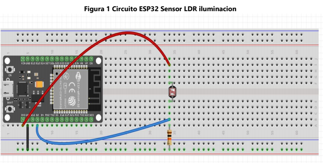
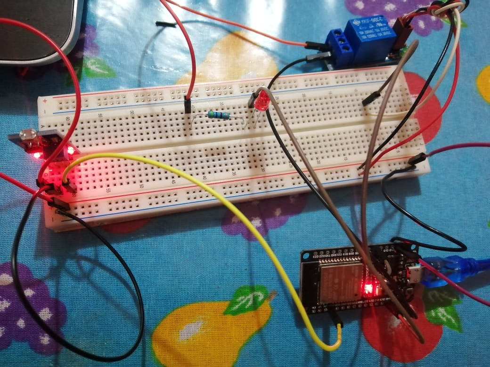
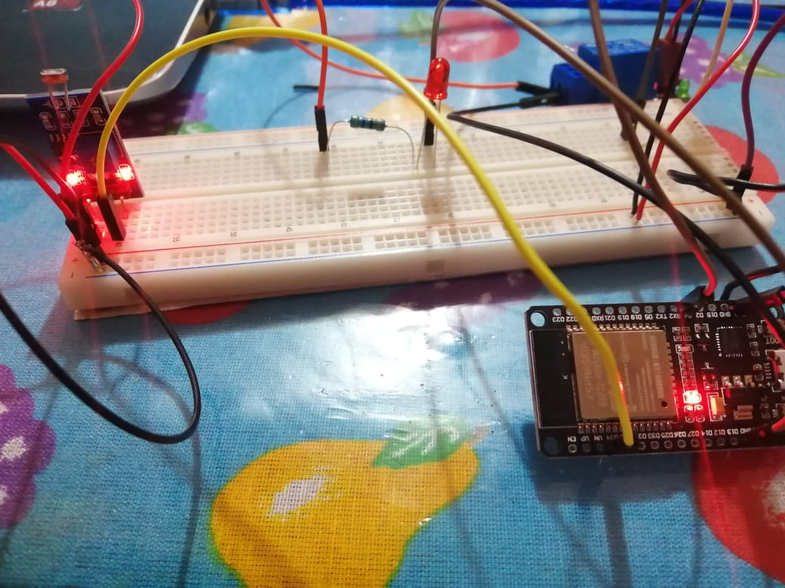
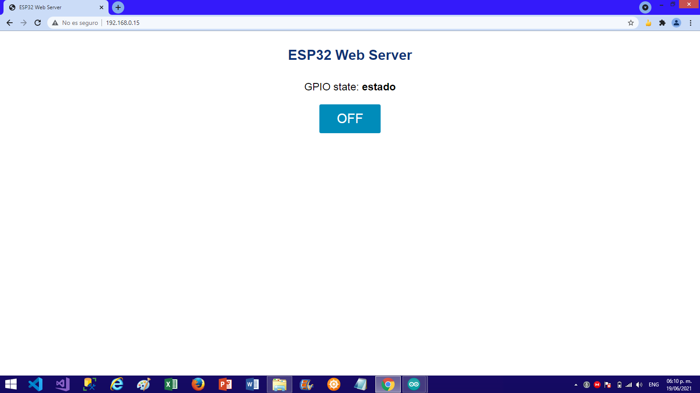
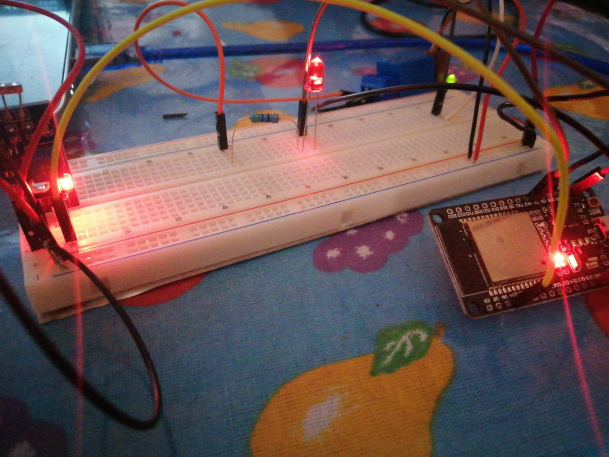
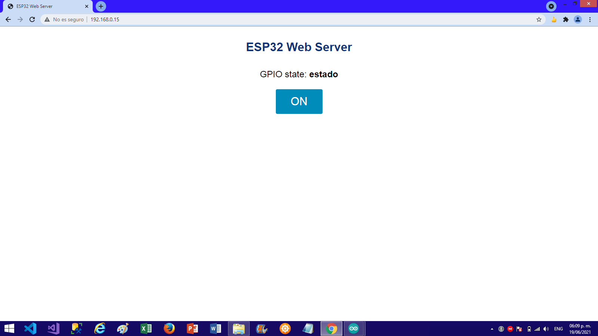
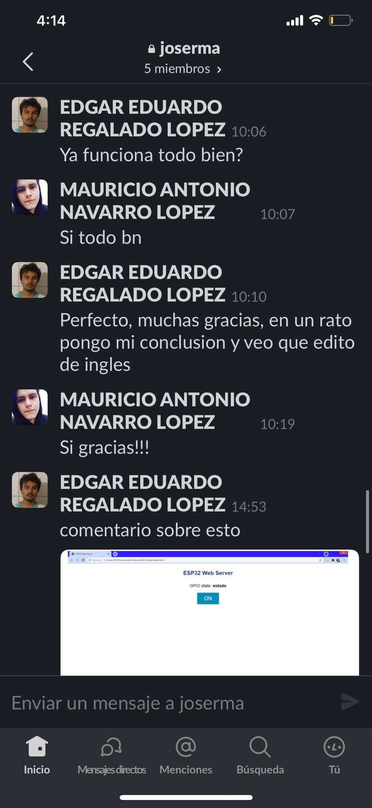
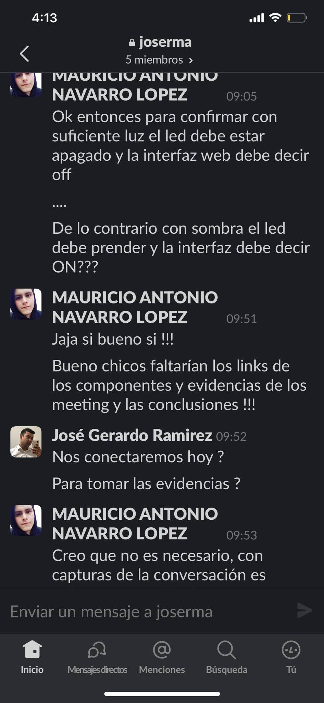
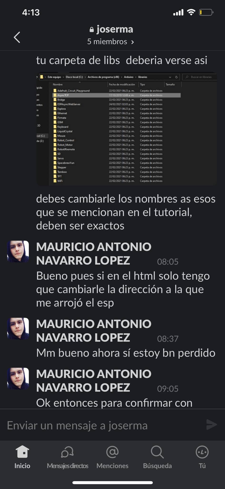
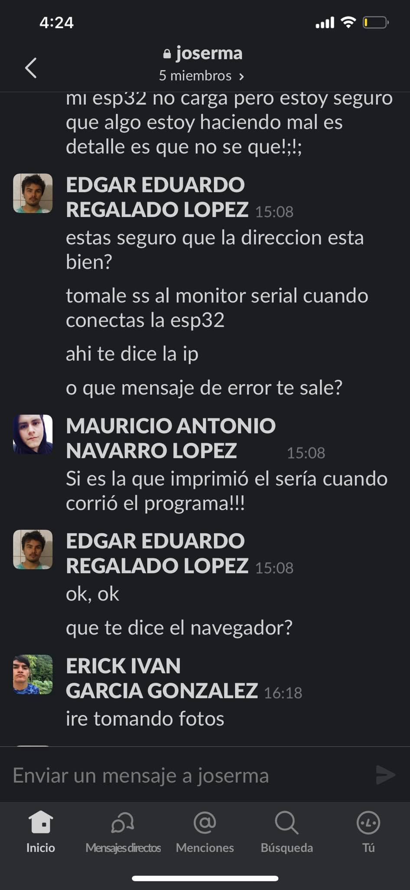

# :trophy: A4.2 Learning activity

(NodeMCU ESP32 light actuation and light sensor circuit via Wi-Fi)

---

### :pencil2: Developing
---

#### 1.Use the following list of materials to prepare the activity

| Quantity | Description |
| -------- | ----------- |
| 1 | [LDR Sensor Module](https://www.instructables.com/LDR-Sensor-Module-Users-Manual-V10/) |
| 1 | [3.3v relay](https://components101.com/switches/5v-single-channel-relay-module-pinout-features-applications-working-datasheet) |
| 1 | [Light bulb](https://learn.adafruit.com/all-about-leds/the-led-datasheet) |
| 1 | [5V power supply](https://www.ti.com/lit/ds/symlink/tps65133.pdf?ts=1624140023858&ref_url=https%253A%252F%252Fwww.google.com%252F) |
| 1 | [NodeMCU ESP32](https://www.espressif.com/sites/default/files/documentation/esp32_datasheet_en.pdf) |
| 1 | [BreadBoard](https://components101.com/asset/sites/default/files/component_datasheet/Breadboard%20Datasheet.pdf) |
| 1 | [Jumpers M / M](https://www.mouser.mx/ProductDetail/BusBoard-Prototype-Systems/ZW-MM-10?qs=I13xAFqYpRS2vPPNkDxO%2FA%3D%3D) |

#### 2. Based on the image shown in the Figure 1, Assemble an electronic circuit and add a Led to one of the device's terminals, in such a way that a system capable of complying with the following instructions can be obtained:

- The NodeMCU should be used as a standalone Web server, which should provide a visual interface, which will show an image representing an "ON and OFF" behavior depending on the ambient lighting condition.
- The lighting sensor should be measuring the amount of light that exists in the environment. 
- When the LDR sensor detects the absence of light should show an "ON" status on the Web interface, and otherwise the "OFF" status should be represented.
- Add a relay to the circuit in figure 1 in series with a light bulb, which will be activated in the opposite condition to the "ON" and "OFF" state, that is, once the sensor detects little or no light, it will activate the relay and by being it will turn on the bulb, and otherwise it will turn it of



#### 3. Place the image of the assembled circuit here.



#### 4. Place in this place the program created within the Arduino environment.

```C
#include "WiFi.h"
#include "ESPAsyncWebServer.h"
#include <ArduinoWebsockets.h>

#include "SPIFFS.h"

//pins
int gpio_light = 34;
int gpio_led = 4;

const char* SSID = "I-------A"; //esta es mi red de wifi
const char* PASSWORD = "7----------A";

using namespace websockets;

AsyncWebServer server(80);
WebsocketsServer socket;
void setup() {
  // put your setup code here, to run once:
  Serial.begin(115200);

  pinMode(gpio_light, INPUT);
  pinMode(gpio_led, OUTPUT);

  if(!SPIFFS.begin(true)) {
    Serial.println("Mounting SPIFFS bad");
    return;
  }

  WiFi.begin(SSID, PASSWORD);
  while(WiFi.status() != WL_CONNECTED) {
    Serial.print(".");
    delay(200);
  }
  socket.listen(8080);

  Serial.print("Servidor On: ");
  Serial.println(WiFi.localIP());

  server.on("/", HTTP_GET, [](AsyncWebServerRequest * request) {
    request->send(SPIFFS, "/index.html", String(), false, NULL);//quizas truene
  });

  server.on("/style.css", HTTP_GET, [](AsyncWebServerRequest *request){
    request->send(SPIFFS, "/style.css", "text/css");
  });

  server.begin();
}

WebsocketsClient client;
bool con = false;
void loop() {
  // put your main code here, to run repeatedly:
  if(!con) {
    client = socket.accept();
    con = true;
  }
  if(!client.available()) {
    con = false;
    return;
  }
  Serial.println("mandando datos..");
  int light = analogRead(gpio_light);
  int percentage = (light / 4095.0) * 100;
  if(percentage <= 50) {
    digitalWrite(gpio_led, HIGH);
    Serial.println("LEEEED");
  } else {
    digitalWrite(gpio_led, LOW);
  }
  client.send(String(percentage));
  delay(500);
}
```


#### 5. Place here evidence that you consider important during the development of the activity.






#### 6. Insert images of evidences such as meetings of the team members held to the development of the activity.






#### 7. Include the individual conclusions and results observed during the development of the activity.

### Mauricio Navarro

With the development of this activity will be generated learning curve since again components are implemented that will not be used previously, however at the time of weaponizing the circuit was not so complex since these components had certain common characteristics of other components previously used, the rest was to design and create a web page of which would provide the ESP32 since previously it had not been programmed on the web, which generated some conflicts but that in the end results were achieved, reactivity is fulfilled with total satisfaction since it was possible to contact an LED through a relay which to turn on and off according to the reading of a lighting sensor, all this synchronized with the help of the ESP32.

### Edgar Regalado

Luckily i worked in something similar (esp32 in web) for a project of another course, and i learned to used web sockets to have a real time communication between server and client. And even though in that project i used the ESP32 as a client (because its way easier that way, but you also need a computer to be the server), making this project wasn't that different from that other project, except that in this one we have one server giving the web page to a client and also an additional websockets server to send the data state of the light sensor in real time to the client without the need to refresh the page

### Jose Gerardo

For the activity we use the ESP32 with a photoresistor and a Relay that activates a bulb, using WiFi protocol to communicate to a web page created through code. The difficult thing in practice began in programming, WiFi libraries are used to create a server to establish communication between the EPS32 and any device with a web browser. The html were programmed into the code in the Arduino IDE, then by a method these are sent to the server to display the state of the focus on the web page. The main condition is in the reading of the photo resistor; depending on its reading, the focus is turned on or off and the entire process of displaying the state of the focus along with an image is done on the web page.

### Erick Garcia

In this practice, a circuit that allows a spotlight to be turned on by not detecting lighting and turning off when it is detected again, which can be implemented in autonomous lamps such as those found in the streets. In the realization of the code we had some problems since some methods were not executed correctly since the program did not detect them so we had to change the method several times until they ran normally. We used the LDR photoresistor that we had already used previously , a relay to control an external power source, the esp32 module and a bulb to make the circuit, we had some problems in the execution of the circuit since the bulb changed the state of the circuit so we opted to add an object that would prevent the passage of light and thus not alter the operation of the circuit.


---
### :bomb: Rubric 

| Criteria | Description| Score|
| --------- | ----------- | ------- |
| Instructions | Is each of the points indicated in the Instructions section fulfilled? | 10 |
| Developing | Was each one of the points requested within the development of the activity answered? | 60 |
| Demonstration | Does the student introduce himself during the explanation of the functionality of the activity? | 20 |
| Conclusions | Is a personal opinion of the activity included by each of the team members? | 10 |

**GitHub's Links**

[Edgar Regalado](https://github.com/RegaladoEdgar/Sistemas-Programables)

[Mauricio Navarro](https://github.com/Mauricio-Navarro/Sistemas-Programables-Mauricio-Navarro)

[Erick Garcia](https://github.com/ggerick/PrimeVault)

[Jose Gerardo](https://github.com/Josejgr27/Sistemas_Programables)
