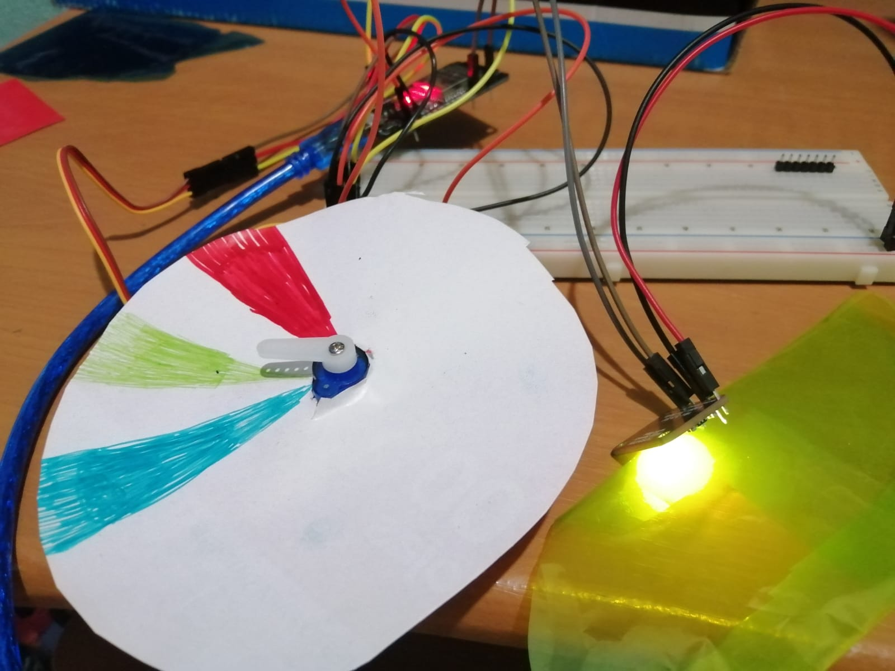

# :trophy: A5.1 Learning activity

(Sensor system and actuation of the color of an object, and visual interface)
---
### :pencil2: Desarrollo 
---
#### 1. Use the following list of materials to prepare the activity

| Quantity | Description |
| -------- | ----------- |
| 1 | [ RGB Sensor TCS34725](https://www.amazon.com.mx/Adafruit-TCS34725-Sensor-Filtro-Blanco/dp/B00OKCRU5M/ref=sr_1_1?__mk_es_MX=%C3%85M%C3%85%C5%BD%C3%95%C3%91&dchild=1&keywords=Sensor+RGB+TCS34725&qid=1624576990&sr=8-1) |
| 1 | [SG90 servo motor2](https://www.amazon.com.mx/Servomotor-Control-Helic%C3%B3ptero-Accesorios-motorreductor/dp/B08D75LSMR/ref=sr_1_4?__mk_es_MX=%C3%85M%C3%85%C5%BD%C3%95%C3%91&dchild=1&keywords=sg90+servo+motor+2&qid=1624577075&sr=8-4) |
| 1 | [5V voltage source](https://www.ti.com/lit/ds/symlink/tps65133.pdf?ts=1624140023858&ref_url=https%253A%252F%252Fwww.google.com%252F) |
| 1 | [NodeMCU ESP32](https://www.amazon.com.mx/ESP-32-ESP-32S-ESP-WROOM-32-ESP32-S-desarrollo/dp/B07TBFC75Z/ref=sr_1_2?__mk_es_MX=%C3%85M%C3%85%C5%BD%C3%95%C3%91&dchild=1&keywords=esp32&qid=1599003438&sr=8-2) |
| 1 | [ BreadBoard](https://www.amazon.com.mx/Deke-Home-Breadboard-distribuci%C3%B3n-electr%C3%B3nica/dp/B086C9HK7V/ref=sr_1_22?__mk_es_MX=%C3%85M%C3%85%C5%BD%C3%95%C3%91&dchild=1&keywords=breadboard&qid=1599003455&sr=8-22) |
| 1 | [Jumpers M / M2](https://www.amazon.com.mx/ELEGOO-Macho-Hembra-Macho-Macho-Hembra-Hembra-Protoboard/dp/B06ZXSQ5WG/ref=sr_1_1?__mk_es_MX=%C3%85M%C3%85%C5%BD%C3%95%C3%91&dchild=1&keywords=jumper+wires&qid=1599003519&sr=8-1) |

#### 2. Based on the images shown in the Figure 1, create a system capable of meeting the following conditions:

- The first phase of the activity will consist of, when placing an object in front of the RGB sensor, it should identify what color it has (it is advisable to use Red, Green, and Blue objects for greater precision), which should be shown in a visual interface. what color was detected.
- The second phase will consist of adding an actuator and a color identifier supported by a color band as shown in image 1; Knowing the color of the object, the actuator should point to the color that is being detected.


#### 3.Place the image of the assembled circuit here


#### 4. Place in this place the program created within the Arduino environment

[**Link Code**](https://github.com/Mauricio-Navarro/Joserma/blob/main/A5.1%20Interface%20Node%20Red%20Sensor%20RGB/A51%20code/A51Code.ino)

```C

#include <Servo.h> //https://randomnerdtutorials.com/esp32-servo-motor-web-server-arduino-ide/ 
#include "WiFi.h"
#include "ESPAsyncWebServer.h" //https://randomnerdtutorials.com/esp8266-web-server-spiffs-nodemcu/
#include "ArduinoWebsockets.h"
#include "SPIFFS.h" //you need to have the spiffs data uploader installed
#include <Wire.h>
#include "Adafruit_TCS34725.h"
#include "ColorConverterLib.h"

Adafruit_TCS34725 tcs = Adafruit_TCS34725(TCS34725_INTEGRATIONTIME_50MS, TCS34725_GAIN_1X);

const char* SSID = "IZZI-542A"; //wifi network
const char* PASSWORD = "704FB814542A"; //password


using namespace websockets;

enum Color {

  RED = 0,
  GREEN = 1,
  BLUE  = 2,
  NEUTRO =3

};
int readRGBSensor(double hue)
{
  if (hue >= 0.90)
  {
    Serial.println("Rojo");
    Serial.println(hue);
    return 0;
  }
  else if (hue >= 0.22 & hue <= 0.50)
  {
    Serial.println("Verde");
    Serial.println(hue);
    return 1;
  }
  else if (hue >= 0.50 & hue < 0.90)
  {
    Serial.println("Azul");
    Serial.println(hue);
    return 2;
  }
  else
  {
    Serial.println("Neutro");
    return 3;
  }
}
int gpio_servo = 13;
Servo myservo;   


AsyncWebServer server(80);
WebsocketsServer socket; //websockets for realtime updating
void setup() {

  myservo.attach(gpio_servo);  // attaches the servo on pin 13 to the servo object
  Serial.begin(115200);

  if(!SPIFFS.begin(true)) {
    Serial.println("Failed to mount SPIFFS");
  }

  WiFi.begin(SSID, PASSWORD); //connect to network
  while(WiFi.status() != WL_CONNECTED) {
    Serial.print(".");
    delay(200);
  }
  

  Serial.print("Server ON: ");
  Serial.println(WiFi.localIP());

  server.on("/", HTTP_GET, [](AsyncWebServerRequest * request) {
    request->send(SPIFFS, "/index.html", String(), false, NULL);
  });

  server.on("/style.css", HTTP_GET, [](AsyncWebServerRequest * request) {
    request->send(SPIFFS, "/style.css", "text/css");
  });

  server.begin(); //http server begin
  socket.listen(8080); //websockets listen

    if (!tcs.begin())
  {
    Serial.println("Error al iniciar TCS34725");
    while (1) delay(1000);
  }
}

void move_servo(Color color) {
  if(color == RED) {
    myservo.write(90);
  } else if (color == GREEN) {
    myservo.write(135);
  } else if (color == BLUE) {
    myservo.write(180);
  }
  else {
    myservo.write(45);
  }
}


WebsocketsClient client; //web page
bool con = false; //is connected?
void loop() {
  if(!con) {
    client = socket.accept();
    con = true;
  }
  if(!client.available()) { //if not connected go back
    con = false;
    return;
  }

uint16_t clear, red, green, blue;
  tcs.setInterrupt(false);
  delay(60); // Cuesta 50ms capturar el color
  tcs.getRawData(&red, &green, &blue, &clear);
  tcs.setInterrupt(true);
  // Hacer rgb medición relativa
  uint32_t sum = clear;
  float r, g, b;
  r = red; r /= sum;
  g = green; g /= sum;
  b = blue; b /= sum;
  // Escalar rgb a bytes
  r *= 256; g *= 256; b *= 256;
  // Convertir a hue, saturation, value
  double hue, saturation, value;
  ColorConverter::RgbToHsv(static_cast<uint8_t>(r), static_cast<uint8_t>(g), static_cast<uint8_t>(b), hue, saturation, value);


  if (readRGBSensor(hue)==0){
  Color color_reading = RED;
  move_servo(color_reading);
  client.send(String(color_reading));
  delay(500);
  }
  else if (readRGBSensor(hue)==1){
    Color color_reading = GREEN;
    move_servo(color_reading);
    client.send(String(color_reading));
    delay(500);
    }
      else if (readRGBSensor(hue)==2){
    Color color_reading = BLUE;
    move_servo(color_reading);
    client.send(String(color_reading));
    delay(500);
    }
    else {
    Color color_reading = NEUTRO;
    move_servo(color_reading);
    client.send(String(color_reading));
    delay(500);
    }
}

 ```

#### 5. Place here evidence that you consider important during the development of the activity.


#### 6. For the demonstration of the activity, more than one object must be used to cover at least three colors.





#### 7. Individual conclusions from every team member.

### Edgar Regalado 

I worked more on the server and servomotor part of the activity. I knew from what we've been seeing in class that the servomotors are manipulated by using PWMs, but in this we downloaded a library that helps a lot with the using of this actuator. Its as simple as just declaring an object and then starting it, indicating the gpio pin where you have the servomotor plugged, so you dont have to deal with channels, frequencies and pwms at all, you just need to call a function to move the motor x degrees. As for the GUI we used html + css and websockets in js, mostly because i already used the tool in another projects and i just think it woks well for real time communication.

### Mauricio Navarro

With the development of this activity new knowledge or a great learning curve is generated regarding the development of a visual interface, however it is very interesting the fact that as programming a circuit, whose functionality that exists the physical and in an interface, effectively motivates to want to know more about the development of interfaces that alavés work with electrical circuits. The activity consists of reading the data from a color sensor and using these to be implemented with the help of what was done and an interface, the objective of the activity was fulfilled plus a new learning generated.

### Jose Gerardo 

In this activity we saw how to use a color sensor module powered by a 3V source, which returned the values ​​with the RBG color format, so we had to convert it to another HVS format that made it easier for us to know what color was being seen for the Decision-making, looking for a library that would serve us for the DOIT ESP32 DEVKIT V1 platform took us a while, but finally we found it, and from there we only used the HUE to take colors and depending on the HUE, decide what color we are seeing, between Red, Green and Blue, showing the result within a Node-Red dashboard, as well as with a 5V powered SG90 servo motor that points to the color that was placed in front of the color sensor when it is detected as any of the three colors , the connection to the Node-Red could be done with mqtt, which is one of the most used ways to connect devices such as esp32 to the platform.

### Erick Garcia

In this last practice, it incorporates what was requested in several previous practices, the complexity mostly lies in the Arduino IDE code. It begins by using a module with an RGB sensor, and a servomotor connected to ESP32; With this, it is possible to program to connect with the node network by linking the computer with the ESP through WIFI, using the computer as a server and the ESP as a client, in our code all the connection methods are used, and sensor reading, but The fun starts with the conversions from RGB to HSV format because RGB handles three values ​​to determine the resulting color and HSV handles one to determine color and the others are to determine the presence of white or the presence of black. Which are ignored by the code. Then this information is sent to the node network and it is displayed in the interface with a module that splits the information to separate the information received and display the colors, with their legend when red, green or blue is detected. The only thing the servo motor does is take a certain angle to indicate on a sheet of paper the color that is detected. With the code we send the degrees that we want to move the servo according to the case of the detected color.


---
### :bomb: Rubric 

| Criteria | Description| Score|
| --------- | ----------- | ------- |
| Instructions | Is each of the points indicated in the Instructions section fulfilled? | 10 |
| Developing | Was each one of the points requested within the development of the activity answered? | 60 |
| Demonstration | Does the student introduce himself during the explanation of the functionality of the activity? | 20 |
| Conclusions | Is a personal opinion of the activity included by each of the team members? | 10 |

**GitHub's Links**

[Edgar Regalado](https://github.com/RegaladoEdgar/Sistemas-Programables)

[Mauricio Navarro](https://github.com/Mauricio-Navarro/Sistemas-Programables-Mauricio-Navarro)

[Erick Garcia](https://github.com/ggerick/PrimeVault)

[Jose Gerardo](https://github.com/Josejgr27/Sistemas_Programables)
