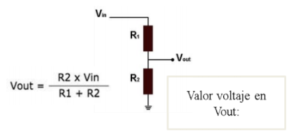
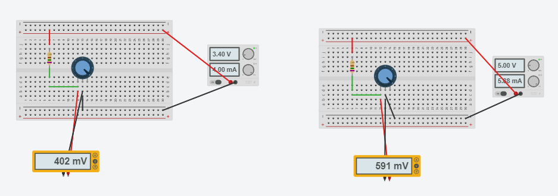

<pre class="hljs"><code>
| readme.md
| | blog
| | | C1.1_TituloActividad.md
| | | C1.2_TituloActividad.md
| | | C1.3_TituloActividad.md
| | img
| | docs
| | | A1.1_TituloActividad.md
| | | A1.2_TituloActividad.md

</code></pre>
<h2 id="pencil2-desarrollo"><strong>Listado de preguntas</strong>

<ol>
<li>

Cual es la diferencia entre un sensor y un transductor? 

R= Un sensor es un elemento electronico que mide vambios fisicos y un transductor es la combinacion de un sensor mas un acondicionamiento de señal que se refiere a un acompañamiento de un circuito para trabajar con el.
</li>
 
<li>

Cuales son los elementos importantes de un sensor?

R= La resolucion y la sensibilidad
</li>
 
<li>

Que nombre recibe un elemento electrónico en el cual su valor de resistencia es dependiente de la cantidad de luz al que esta expuesto?

R= Fotoresistor o sensores LDR
</li>
 
<li>

Calcular el valor de voltaje en Vout dado que R1=750 ohm, R2=100 ohm y Vin= 3.3v

R= [(100)(3.3)] / [750 + 100] = 330 / 850 = 0.38v = Vout
 
 

     
 

</li>
 
<li>

Diseñe y simule el circuito anterior utilizando la herramienta tinker cad, y reemplace R2 por un potenciómetro.

</li>
<li>

Que valores de impedancia se debería tener en R2 para que el rango de valor en Vout sea entre 0 a 3.3V, si Vin es de 5v y R1=750 ohms? Explique los cálculos realizados para obtener ese valor.

<table>
<thead>
<tr>
<th>Vout</th>
<th>R2</th>
</tr>
</thead>
<tbody>
<tr>
<td>0 v</td>
<td>[(0)(5)] / [750 + 0] = 0 / 750 = 0v, 0Ω</td>
</tr>
<tr>
<td>1.5 v</td>
<td>[(322)(5)] / [750 + 322] = 1610 / 1072 = 1.5v, 322Ω</td>
</tr>
<tr>
<td>2.2 v</td>
<td>[(600)(5)] / [750 + 600] = 3000 / 1350 = 2.2v, 600Ω</td>
</tr>
<tr>
<td>3.3 v</td>
<td>[(1500)(5)] / [750 + 1500] = 7500 / 2250 = 3.3.v, 1500Ω</td>
</tr>
</tbody>
</table>
</li>
<li>

Coloque aquí evidencias de la simulación realizada.

     
 

</li>
</ol>

<h3 id="bomb-rubrica"><img class="emoji" alt="bomb" src="data:image/png;base64,iVBORw0KGgoAAAANSUhEUgAAAEAAAABACAYAAACqaXHeAAAUH0lEQVR4XuVaCYxdV3n+7vrWmbfOas94iw12EodskIBDirKRYtoKFVpECUUsaUFqqaBVhRA4alEppaW0qKBWagGJlkCpWoRKRUQb1gLBJM7i2CHxGHu8bzNvvcs59/T/f52r9xShqoLHYnpmPp/zlnnvft+/nnPtGGPw/3n4+DkYDo19NL3ySvgzMwi1rpZK096UX3YrqpyFcGE8zx8m2vRck3XXsBZ9/GNI3mNM5v68kN8LePNVFL2s1CDyy07Z3ZlNOzf6Ve8Wr+q/0Amz54XFbKuLbKaR1EqvuRsBAFz2AuTkt1yBkhOU6vD9JbccXu0tVl/ibWnsxbb6y53l0l7MBneZsvcCVP2tTsm0ms1mQQS43K1/K+AuLiLIauWKa8LZIAx3eHP1m3H11tvMi+54sbPnzpu8a7ff7G2u7fEa4U1eiJ2O788Usrj0c5EDZq+EWwoQptqvZjCzfqHwXLNlw/W48S3PDXbcXoTjIRs8CtT+rOCqJxLVU8cxTI+kheDUZe8Bnwbcch9u5FSDwFdVxzMziR9uxsKujdh4W/FCbwrKTMOv70G28Q0F3Ww3EfotN3MqbpJd3jnAocFzIYHrJcbTxg/T2KmaSNfiTr/wlf2noJRGuQg4TNTfBo2KkyRwTepoo53sshbA0JgRbnao1ERxhvPdofnLL18sPnH0EjLtIFJAlAL60nGVnB10h2v6Uhqbrk6T+LIPgXOA0S4hdrQyenAsydR79eZd+83VxYunjuILXzuEAw89CX3wC+ng239/oXvo3MrFk+n3444+H6z7w8s+CR4EzJU16JbXG6wMq/p9zZ2/GTVu2FTJBnj4sQPQj39qePfW9U4XUa9z8sLxiyfWH0uj9Mi075131jrR1OUuwD7AvOdxk3xx3gn+ZGnnX6C+86YSYqyt91Bde+zE7emRJ04d91TfoNNL1Wo/zZ6owazUWv6lZwIkc5dTCLzktl9627YdO1/x7DzwoOP4+zbc+Km0vumlPiJ0hpfgnHrk8ReePPSJpy8l33n0XLz/qQvRQ0fW1f4L3eRQ0Tir51fXhp/fD33Z5IAbbr7ld5a2Xv/Bd7/3Hz77ktv2fnCsEri/t/uGz5np2b2hYfJdqFOHv1U+dvDPD/bSx5/pZwdXBurAsW76yPlYH6x76ZFNUX/tk08jZe+ZfA4YXZhfq80tBYHbAkw1NambGTNEml7sdrunjDEd/B/Hc3btfmulMvWhMyeO4Py5Dj7xyX99292/eM+1/3HgS7+49bnPu79Ya94dQKETZUjPr37t0jNP/vFxoHdVGcoYN6746aAB9LZrdHetInoYyJg8DwCY2Ha42ZzbHRT8uxzHu911netcx22Dh+HfDJnOoDONLNNDpfSTmU4fpPUX+/3+AyRIhh8wNm254t5Wc+6ji0u7sXTF1XjZXbdh7x3PAY+Xvuw3sHrsEGr1JqI0xfrFU1898b3D74qAS1uAzlVT6O8sIL6hCLV1FeoIkB3knDH2XT+yALt3726sdQZvceG+0fW8zUHow/MCuK4L26cQ4QyGoBlKQWsFpVKkacIzY6BSdX+SZH+VJL1HYMeWLTt+q96a+cji4ha0F67GPa99FW7bswX5+NhnvoOPfPAP0OuuozccfunYM0++G8BFqY7A+j5r6fF8ka9/ZAHm56+p+P76fX5YeHsxLKJYLqNQLMH3WQBfBOBhMoPMEHHNsKQJaSprJAk/jpEKUsRJ8kA00PduWF64ZaY9//HZuUXU69vwhnvfiDtv3Y58vO6N78E3vvwvaM/M4tixp9OTJ47dasmfJnSY7I/tQGT79l2vDQvpR6amW5VKtYpyaQrFUglhoUgCMAJr+ZSgoJWGWJoJpwpCNhEgSiIkcUhChPDpsQP3jkrJO9Kst9BotFGZquPV97wmJ4/1AfDmN70D3/rvzyOJB7hw+AwcOAGADxFuH88tExfgqquuCnvD5GOBH756fmEDqlPTmKo2UKm0UayKCOIBjuvAaI2USccRESaSydDOMRFm0jFiIu/HAWISLCBErgdK6hLT1ek6WNxffsUbcP31u3F6DTi5egnveudbceC734QxGsPhAMNBH3EcIQiCG8Ni+Q8BvBP/y/ihQ+C66/Ysnj9/+otT07Urm+1Z1GptTDcW0aA1PYepSh1TU1V4vodEKaR0YVHMF5cginqI+rSmOU6GNBNiniNEdp2SGJ1OBxG93qq30ZpZwMt+5R5ce90ewHVx8uQxfPRD78Khgw+DRxzL37KYInid/oZzW7ez9kql1D9P1AOuueYFW9bWzn+93mwvtNpzaDU3oLWwjGZzHsubtmLr1mXMtpsoFAOJea0M1rsdrK6exNnTJzGMq+h3u2StEgb9HoKgBz/wxVsocdqE6aJUSun1Lmg/j93X34JCqYpDhw/gzOkT+LfP/C1WjjwliTWRsIklh7iOQ8LXJbFGwwHNen5yISCWv25mba37pXpzZqHN5Ge3Ym5xCRs2bsX1N1yDbZs3oOADmTFwDGd6aQJQrTZIoAaO1qZx/NgKwiCAVAgiHvQ8eJIsPQCuvN9IrTTokHDz80vQaYxDjz+Ezvp5fOMrD+D02VU4ABFPmDgTFTFK5So9VkjSCCpN32GM+fCkBJCYX+8MPl1vtLY0WzNotTcJ+e07rsKL9zwfs60KEVbgwVwcnuFAKQPjaAQusLS8KC5+7qwL1wEc/jEQSwptA4Bnndleoo2jR5+yFWKIQ08+iu76JRhAqoRmZBo8grBoy6iU1g8AuN+hYWhMRIBuP91Xrkz9AielWn0BM/Mbsby8Tci3m2UYk8Inlh4Td1xkYkWWlGblwPczBAZoEakhub5jNOTapA+R8ogsI2gNpYUEKpRMh2dO4eH9X0cUDUiEFADkdUMQ8uDP9qCJPHHlz/gwkyfETH4iHjA3t+FFlOV/f7pWxzTFWL09j0ZrjpLSdUSoDBhFBF24rtgU8mvEpuzRAhcEx6AQhtwj2AaIXbgo68ySZguOyqRH30OCReQ1505zqIjHZEojM0JevlNrnTc3fwPgH/PmZwI3RsQ9g6XlrX9aKlf8SnmKanEbtekGNm5cxqalWbFYEDrwXHm3kGXdc/FzAeCyAASaw6AAFSYoFArsyiwEQeo/lzD4Al77SGJQFZjnlhnHj69IF8nDkmfSAgB/TfgnwinCaXouwQ8xhMY4ZuYWXxGGhReVShWQCNyMSLJZ2LCIwIew9ZiwRL0lDyGPTFxSxBDLGYLWhoh5kvUDISl1H77A51m6R08qgqyJtKLyWsfCwhI8URr5nJM/mJNnEPkYP+Rwn72LC7zgd7mrKxCKhRIKhAoJMTVVRqYNmFmGcauLRcbJEyA5QWUGqVZc6iw8CFFbAm01sO2zx99v4bEHSHM1N78B5UrVdpfGfoa/C0AglrfkJyJAozFzE13UC4KwgLDAKCEMQ/ic5o0DLQzBRIWgNoRMiOfkAV7b56JIAyYX180JwhV4BBcYf96lNUNiyJG+gp5lT2QR+JpEMGu7Xyfy0SRvjrJL/moQhm4g7SkR9wtiOQ0N2sdD6zZSpJCLMxLfeRjIP5nMvHQQx5qgxmLYMCexrizsEK7jzzwrkXO1MFZ4z/WgTP555pUA3jIpAVj1wtz8xjvEJcVF2To25h2DC+fOoLMwi+lKgUjwRTnShloCFkZifhBrAvtIJq5sE5cVR9uwydWCrG0wjcW5g/Fh7M/Io5w24VpjzMMTEaBSr+8k0ttYAIlXdk0mYDLptobDPr6/coza32VMVXnXB3iGy97IYkmaCWJloBla21pvZNZWjMyS51Cxz9lzA5mtYHa2jEfCYBx3ESYjgG+cm1zyAtfGJNPSRiHjPbxFr3sJq8eBeqOJaqWMMPRFLMkB0gobyRX5/l+pVNZKJ/I405pmlc8CESizQglpwYi8FWOc+1jQ3Ep430QEINbPt735yAJESOlUtrFRPEQxKSKK+lhbg2w+wmIRgevD4Wzu2uIPM97k5IcdecMDWRN4LSLI81YM9SxRNMEm1FwUgIG8/9iNH3G4wp0HcAWQx6p1WZUSuC+X7avdgw9oTYgjxPSYhUljfm6IhGeC7NiSlN/DYAEJCUF2cbko48di0CPyNnQYGWPkAWZE3o4W565JlEHPOJixlmf1RxZUMVQS86aG+3MWQTAY9Gm2YCGiocxJzGRj9hTC0IowtBgJkcQjMaxHWE/IbJiMC2AseYZjAVjypUmEgIfMFJm8HGGlCmIhRUiEAIKh9APSiIzcvJh3c7aRyY1kIGQIKuXwiUU8ESTqE0iUJPcOFkEwOjdUozAY9wLAyX/Hc0I4EQEM211by2uJU6TWddnlg4AF8G0/zglPYnq8lZUmBtZaSuv89JeJMmnrQUMrBMGGByMVIWw4jLa5UjYFkgiMlGdejsRGNgkBXK10n5WWC7fJK09+PpP3e9LBAWINyEUWFOQ1z82PwvN6Dq2sAImyXiSkbQj1rQiRIImj0SmxYtgEqTNkjMzA2M92QbMtndYXokkIwB94OtPqaq1y6yccp2xhxoig3cunYqVE7gPk1ndzAYyxpU4OMRBLDmExJVnanDHKDSMvYIj1BTYEmKzAy0NQpSw2v94BMJiEAKz4YaX1HWI1yfx2p+bLl8KRHwMlXqJQYJcNC3ZDI6GR9/D5zZA8sSGx3sTkhXg0CgO2fmyRSPwzlPUAzWJb8q6EoRZhTF67VwGDSQiQkeKP+koZsr5jLS+JKieVl0gSSdw/4a0tCRCISD5EICf3JthKom0ijSWk5DhcEOWlNH/M77ENl8qFs210JsL6vmylSbAhCyKCA85+wJhJCKBpPKYzfSlVqunZ8uS5vghgk5tcjNJSIcQaYcjvkb3DKESMSGXLmIay1SSPcSmT1u0t+VF/YN+rCJnS0iYTd/GwQqkEZRMlkbe0sy8bMxkBFOG0Vvqg9tQeJphEkXyxNT5MZglJaUutNYi4x6FihcoPSay3WFe2dV48wQrBEPIitJTCUQJk8UREB5Y8n0uQ4L31dSZuvVJ4P0iYTAgQImP0VzKt9ijlIo4duELM5Xi2m5ncAxL2ABv/owTpEngYBr/fHmRqNRIhr/uJuHy+zktgTLAtMIx8fhgWMD1dR7fbEdHyM4NMpd8GcHYiAhgaRGCglPpPx/V/23FUI2WLDodiAScsSibPjE1sforUTzhByuu5AHBkllARK5p8R8iiEZTEuBCXtRWGiNkmKOW/Fev7Qr6IWq1Jaxfr6xeYPMHJPewTAOJJHojEhNVMpw9o13mVox1QPkS/383jXGp26nlEXskF2rKUC2DBgiLv3mxvP0psDM3WHntO28YrswcfvmfJ866zOo2jK0+xF3FiZoFZtAsAPkdIJylAQuhpre93XP1SIjPtQNigi3WxhOu5HLO2A/QgW+dcAF6Pzn6EvN3nj2+BLeF8ndj/OCGlTT4jCH0+ixTL833II88cQmd9TRou1/Nsd5j9FYCuoTExAWwYdAA8nWn92cx1Xq8AS2LAMS0XVCyW8g4OgMPbYBaBYOnbvxFko82VFYKQz5Ib7OEIbDgFcgDbmplDqzVLlv8ezp45KfcSA98XYbXSK/ZEuI8JDGdcRBLAA7CRsIOy/IfJvXdIcvOkEZJDydnZRQRhiMGgxwlMylV+hgDH0C+vR5UgDwOlMgAj0uPGC8OQUCTyVczMzqNB5A8/eQArRw5DOtGAICE45DzxawD+iwQ+N3EBrAjTADYT9tCXv58sU4GRmxJClIRBm0SoTzekURrytjgaCjHYHZsBkxaS47kAAMO1jYzL5Pj4XU596/UmZucX4XkhDnz3G1g9vsJC28NZXypFFA3+DsD7CcfkRsgEhrdv3z6Mj/vuuy/l5wnDLEOfBLnZI/ZiTUBittdbl5peb7RQb7akVFmbQyp0JmteWbKO3S67cneoXKqiVCkL6ZmZeSxv3obl5SuwvnYRD33zQXH7QrHId5RE8FTJmeRXAfyRvREi7j95Dxh5QRHAEmED4N5TKISv59pr2Jq5jTMjxGfmFrCwuIQSkeJmpj/oIhoMuP+XkueIzA4Crhie3B1CpTKF6nQNzXob5WoNve5FHHjk2/jeU0+IgMVSBaFY35ezhH5v/XFjcC9bnnCSBMh+rAJYEWpWhHnCa4js66gUcoDbDQryBomtKmGxSEI0iFRYkoOS3P05L7Cr28aGXwsxGA7I0seF9Alyd84nckeKiQdyA4RDi8l/1xi8HcBxwmp+J+gnIYADoGWT4izhTrLem8kyU7DdoY3t/Mib41qqxHStgUZzRu7vleix7OK4g2RrDno4e/YUzp87JeeLAKTVDQuhuLznByJsv9/hY7d/B/ABtjrhBJHvAcBPRAArggtghrBIaBOuJMu+iay4izMzD7vrs6fIsPf9tZDAeGeQr4yt94FPKEqJszdKRcBoGKHbXRuQR3zUNjtnrNt3AOAnKcC4CC3Cgp0bhJf7QWFvsVhoc5aGbX8lJMyo/MEmRH6dEinNkObJE7IezZ50fYAjJ8m9blfTYcmDgPk4gBXCWZv0ugDw0xBgPBzqNhTahGkryJ2UG15MWKCSJWRk6wxn3OrSJLkQAUYnRwYSFnEsx+2DOBk+ZLT5PIADhDXCORaAyEuc/DQFGBeibAVoEWqEsvWI59FrN5II2z3Pn6NYpskXqzsMqRsmT5qyEYqTZE2nyVGl1H4ADxG+T+hZ8ucJF4h8CgA/MwLk3aL1gKYVoWqFCAhTtnJsAZxFip468S+xdsQ7Mcg6MIbd+ihhxVo5tud6XUv+IqGf9/k/awKMCxFY8uMiFAmhFcMjOM/KhBlBE1JLPGKylvw6r8dr/M+yAM/2iAKhkotgH/tjIuAHkB8yYTvH4xa/fAT4wRXDF4y8wLUEtEVqoYX0T3n8D7VEbvsSVs5pAAAAAElFTkSuQmCC" /> Rubrica</h3>
<table>
<thead>
<tr>
<th>Criterios</th>
<th>Descripción</th>
<th>Puntaje</th>
</tr>
</thead>
<tbody>
<tr>
<td>Instrucciones</td>
<td>Se cumple con cada uno de los puntos indicados dentro del apartado Instrucciones?</td>
<td>20</td>
</tr>
<tr>
<td>Desarrollo</td>
<td>Se respondió a cada uno de los puntos solicitados dentro del desarrollo de la actividad?</td>
<td>80</td>
</tr>
</tbody>
</table>

 <a href="../C1.3_CircuitoDivisorVoltaje/C1.3_CircuitoDivisorVoltaje_JoseGerardo.pdf">Ir a sensores</a>

[GITHUB Jose Gerardo Ramirez 17212137](https://github.com/Josejgr27/Sistemas_Programables)

</body>
</html>
