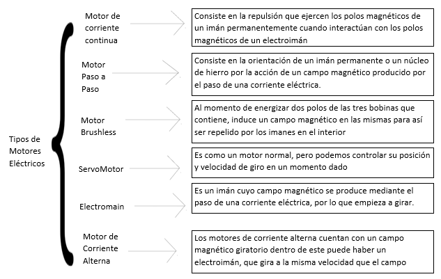

# Actuadores

## :trophy: C2.2 Actuadores eléctricos

**Actuadores eléctricos y sus tipos**

### :blue_book: Instrucciones

- De acuerdo con la información presentada por el asesor referente al tema actuadores y a los videos observados sobre el mismo tema, elabore lo que se solicita dentro del apartado desarrollo.
- Toda actividad o reto se deberá realizar utilizando el estilo **MarkDown con extension .md** y el entorno de desarrollo VSCode, debiendo ser elaborado como un documento **single page**, es decir si el documento cuanta con imágenes, enlaces o cualquier documento externo debe ser accedido desde etiquetas y enlaces.
- Es requisito que el archivo .md contenga una etiqueta del enlace al repositorio de su documento en Github, por ejemplo **Enlace a mi GitHub**
- Al concluir el reto el reto se deberá subir a github el archivo .md creado.
- Desde el archivo **.md** se debe exportar un archivo **.pdf** con la nomenclatura **C2.2_NombreAlumno_Equipo.pdf**, el cual deberá subirse a classroom dentro de su apartado correspondiente, para que sirva como evidencia de su entrega; siendo esta plataforma **oficial** aquí se recibirá la calificación de su actividad por individual.
- Considerando que el archivo .pdf, fue obtenido desde archivo .md, ambos deben ser idénticos y mostrar el mismo contenido.
- Su repositorio ademas de que debe contar con un archivo **readme**.md dentro de su directorio raíz, con la información como datos del estudiante, equipo de trabajo, materia, carrera, datos del asesor, e incluso logotipo o imágenes, debe tener un apartado de contenidos o indice, los cuales realmente son ligas o **enlaces a sus documentos .md**, _evite utilizar texto_ para indicar enlaces internos o externo.
- Se propone una estructura tal como esta indicada abajo, sin embargo puede utilizarse cualquier otra que le apoye para organizar su repositorio.  
``` 
| readme.md
| | blog
| | | C2.1_x.md
| | | C2.2_x.md
| | | C2.3_x.md
| | img
| | docs
| | | A2.1_x.md
| | | A2.2_x.md
```
## :pencil2: Desarrollo

Listado de preguntas:

1.  Basado en el video tipos de motores eléctricos elabore un cuadro sinoptico indicando su clasificación, y
principio de funcionamiento.


<p align="center">
    
</p>
<br>
<br>
2. De acuerdo con el video instalación básica de neumática y arduino, cual es el propósito del
microcontrolador para este sistema? Que otros componentes electrónicos observa en el video?
<br>

R= El microcontrolador se encarga de enviar una señal  a los relays, los cuales envian 24v para accionar las electroválvulas y que estas se cierren con el aire comprimido enviado desde el compresor.

<br>
3. Basandose en el video Como funciona la impresora 3D, que tipo de sensores y actuadores están
integrados, y con que proposito es utilizado dentro de este sistema de impresión?
<br>
<br>

### Motores paso a paso

 Se usa para el movimiento de los ejes X, Y y Z, esto hace mas precisos los movimientos de la impresora 3D.

### Sensor de temperatura

 Se usa para saber la temperatura de la boquilla dispensadora de la impresora y al llegar a cierta temperatura deja de calentar para no sobrecalentarse.

### Motor de corriente continua

 Utiliza un motor de corriente continua el cual se encarga de accionar ventilacion en caso de sobrecalentarse.


### :bomb: Rubrica

| Criterios     | Descripción                                                                                  | Puntaje |
| ------------- | -------------------------------------------------------------------------------------------- | ------- |
| Instrucciones | Se cumple con cada uno de los puntos indicados dentro del apartado Instrucciones?            | 20 |
| Desarrollo    | Se respondió a cada uno de los puntos solicitados dentro del desarrollo de la actividad?     | 80      |

:house: [Ir a Repositorio](https://github.com/Josejgr27/Sistemas_Programables)